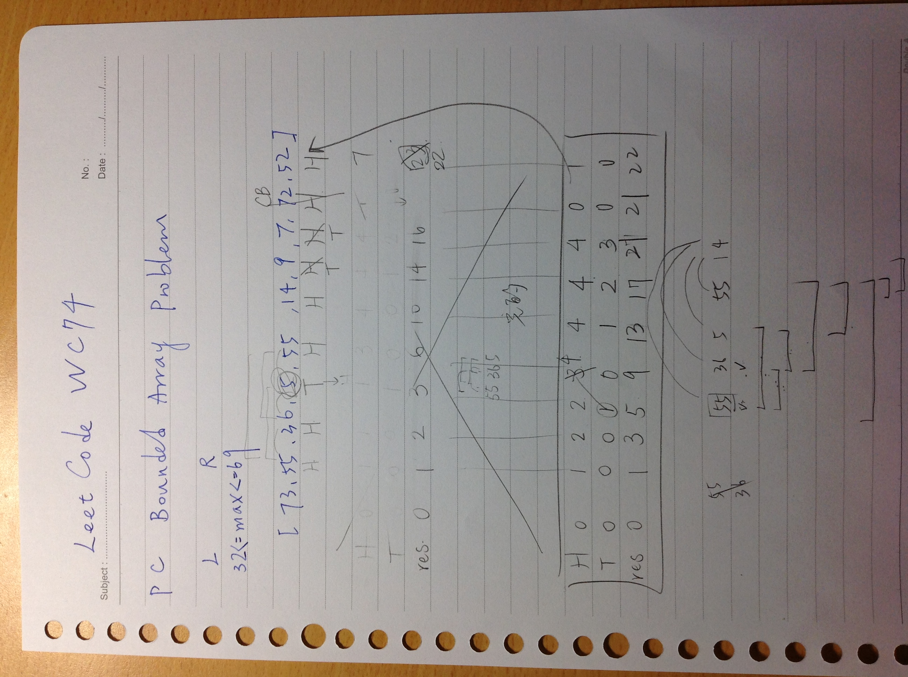

# leetcode_OJ WC74 解題心得
* Contest time: Mar 4, 2018


今天上午打，家裡的網路速度只有學校的百分之一不到R（下載 10 上傳4），加上LeetCode的server一直timeout，用debug模式一直粗不乃，特判和優化花了好多時間才找到w
不過map還真的是好用，而且觀摩了一下uwi和dreamoon的解法，不愧是奧賽大神R
## PA.
[794. Valid Tic-Tac-Toe State](https://leetcode.com/contest/weekly-contest-74/problems/valid-tic-tac-toe-state/)

* 思路：暴力＋情況邏輯特判。
題目規則所述為：
```text
Players take turns placing characters into empty squares (" ").
The first player always places "X" characters, while the second player always places "O" characters.
"X" and "O" characters are always placed into empty squares, never filled ones.
The game ends when there are 3 of the same (non-empty) character filling any row, column, or diagonal.
The game also ends if all squares are non-empty.
No more moves can be played if the game is over.
```
一定要是x先攻，並且有任一方獲勝後則不可以再下標記，獲勝的方法同傳統井字遊戲。
從邏輯來看，首先我們統計o的個數以及x的個數

由於是輪流進行 ，且先x後o，因此x至多比o多出1，而且o不可能大於x，這些都是不合理的情形，可以先刪除
```cpp
if(xcnt==0 && ocnt==1)
{
    return 0;
}
else if(xcnt>ocnt+1 || ocnt>xcnt+1)
{
    return 0;
}
else if(ocnt > xcnt)
{
    return 0;
}
```

接下來檢查獲勝的情形，當獲勝時，只能有一次的獲勝，亦即不能有ooo xxx同時出現的情況
因此我們用 win_cnt來統計獲勝的次數，只要 win_cnt>1一定是不合法的結構。
而在獲勝後，可以判斷是x獲勝或是o獲勝

若是x獲勝，則o一定不可能>=x ，原因乃是x獲勝後遊戲便結束，因此此時的x若是比o多一則正好符合規則

而若是o獲勝，則o『只能』和x一樣多，一樣的道理，獲勝後遊戲便會結束，因此對於<xcnt >xcnt都是不合理的情況

完整AC代碼如下（網路超卡頓無法使用debug模式，只好怒用submit solution來驗證正確，不知不覺吃了8個罰分啊殘念...)

```cpp
//["XOX","O O","XOX"]
class Solution
{
public:
    int xcnt,ocnt;
    bool validTicTacToe(vector<string>& board)
    {
        xcnt=0;
        ocnt=0;
        for(int i=0;i<board.size();i++)
        {
            for(int j=0;j<board[i].size();j++)
            {
                if(board[i][j]=='O')
                {
                    ocnt++;
                }
                else if(board[i][j]=='X')
                {
                    xcnt++;
                }
            }
        }
        if(xcnt==0 && ocnt==1)
        {
            return 0;
        }
        else if(xcnt>ocnt+1 || ocnt>xcnt+1)
        {
            return 0;
        }
        else if(ocnt > xcnt)
        {
            return 0;
        }
        else if(!checkwin(board))
        {
            return 0;
        }

        return 1;
    }
    bool checkwin(vector<string>& board)
    {
        int win_cnt=0;
        int xwin=0,owin=0;
        for(int i=0;i<board.size();i++)
        {
            if(board[i][0]==board[i][1] && board[i][0]==board[i][2] && board[i][0]!=' ')
            {
                if(board[i][0]=='X')
                {
                    xwin=1;
                }
                else
                {
                    owin=1;
                }
                win_cnt++;
            }
        }
        for(int i=0;i<3;i++)
        {
            if(board[0][i]==board[1][i] && board[0][i]==board[2][i] && board[0][i]!=' ')
            {
                if(board[0][i]=='X')
                {
                    xwin=1;
                }
                else
                {
                    owin=1;
                }
                win_cnt++;
            }
        }
        if(board[0][0]==board[1][1]
            && board[0][0]==board[2][2] && board[0][0]!=' ')
            {
                if(board[0][0]=='X')
                {
                    xwin=1;
                }
                else
                {
                    owin=1;
                }
                win_cnt++;
            }
        if(board[0][2]==board[1][1]
            && board[0][2]==board[2][0] && board[0][2]!=' ')
            {
                if(board[0][2]=='X')
                {
                    xwin=1;
                }
                else
                {
                    owin=1;
                }
                win_cnt++;
            }
        if(win_cnt==0)
                return 1;
        else if(win_cnt==1)
        {
            if(xwin)
            {
                if(ocnt>=xcnt)
                {
                    return 0;
                }
                else if(xcnt==ocnt+1)
                {
                    return 1;
                }
                else
                {
                    return 0;
                }
            }
            else if(owin)
            {
                if(ocnt<xcnt)
                {
                    return 0;
                }
                else if(xcnt==ocnt)
                {
                    return 1;
                }
                else if(ocnt>xcnt)
                {
                    return 0;
                }
            }

        }
        else
        {
            return 0;
        }
    }
};

```
## PB.
[792. Number of Matching Subsequences](https://leetcode.com/contest/weekly-contest-74/problems/number-of-matching-subsequences/)

經典題目，看看word[i]是否為str的subsequence
* 思路：兩個指標分別迭代str和word[i]，看到一樣的便將word的指針向前，如果指針最後＝＝長度則存在，否則即無

簡單的想法卻TLE了，因為有大量重複的word[i]需要被重複操作，因此改用map優化統計各種word的出現次數，再將subseq符合的狀況加上map->second計數器即可

map優化過後AC如下
```cpp
class Solution
{
public:
    int numMatchingSubseq(string str, vector<string>& words)
    {
        int cnt = 0;
        map<string,int> mymap;
        for(int i=0 ;i<words.size();i++)
        {
            mymap[words[i]]++;
        }
        for(std::map<string,int>::iterator it=mymap.begin() ;it!=mymap.end();it++)
        {
            std::size_t fd = str.find(it->first);
            cout<<it->first<<" , "<<it->second<<endl;
            if(it->first.size()>str.size())
            {
                continue;
            }
            else if(fd != std::string::npos)
            {
                cnt+=it->second;
            }
            else if(issubseq(it->first, str, it->first.size(), str.size()))
            {
                cnt+=it->second;
            }
        }
        return cnt;
    }
    bool issubseq(string str1, string str2, int len1, int len2)
    {
        int same_idx = 0;
        for(int i=0;i<len2 && same_idx<len1;i++)
        {
            if(str1[same_idx] == str2[i])
                same_idx++;
        }
        return (same_idx==len1);
    }
};
```
## PC.
[792. Number of Matching Subsequences](https://leetcode.com/contest/weekly-contest-74/problems/number-of-matching-subsequences/)


<br />
有點微妙的一題，看似簡單實際上不好拿分
本來的算法如下，總是多一個或少一個，因為在進入的邊界問題沒有拿捏好
```cpp
#define FORI(n) for(int i = 0; i < n; ++ i)
class Solution
{
public:
    int numSubarrayBoundedMax(vector<int>& arr, int low, int up)
    {
        int max_val = 0, can = 0, cnt = 0;
        int pre_max_val = 0, dist = 0;
        FORI(arr.size())
        {
            pre_max_val = arr[i];
            max_val = arr[i];
            dist = 0;
            for(int j=i+1;j<arr.size();j++)
            {
                pre_max_val = max_val;
                max_val = max(max_val, arr[j]);
                if(max_val < low || max_val > up)
                {
                    break;
                }
                dist = j - i;
            }
            if( pre_max_val >=low && pre_max_val <= up)
            {
                cnt += (dist == 0 ) ? 1 : dist + 1;
            }
        }
        return cnt;
    }
};
```

後來參考了[大神的解法](https://leetcode.com/problems/number-of-subarrays-with-bounded-maximum/discuss/117612/C++-O(n)-solution-with-explanations)，理解後如下 <br />

```cpp
//algorithm and source credit to : https://leetcode.com/problems/number-of-subarrays-with-bounded-maximum/discuss/117612/C++-O(n)-solution-with-explanations

class Solution {
public:
    int numSubarrayBoundedMax(vector<int>& A, int L, int R)
    {
        int res = 0, heads = 0, tails = 0;
        for (int val : A)
        {
            if (L <= val && val <= R)
            {
                //如果找到一個符合區間的數值，則之前身為tail的，全部可以被提拔為head，在加上自己本身新找到的數字，因此head += tails + 1
                //而res變可以新增那個長度
                heads+= tails + 1;
                tails = 0;
                res += heads;
            }
            else if (val < L)
            {
                //小於L的數字可以作為區間數列延伸的尾部， 因此陣列又在延長方才的head數目
                //舉例：L=32 R=69 今已經iterate，[55 36] 已經有三個了 在多一個5後，便可有[55] [36] [55,36] [55 36 55] [36 55]
                //因為自己不算在LR區間 因此只能　+= heads 而不需要再加一
                tails++;
                res += heads;
            }
            else
            {
                heads = 0;
                tails = 0;
            }
        }
        return res;
    }
};

```
以[73,55,36,5,55,14,9,7,72,52]<br />
32 <br />
69 <br />
來看，演算法跑出後三變數的結果如下

