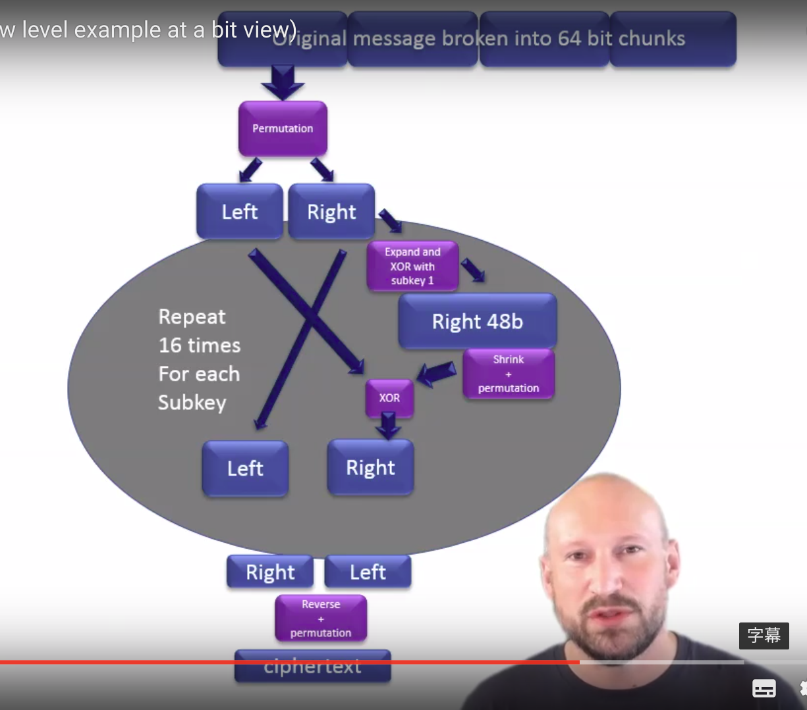
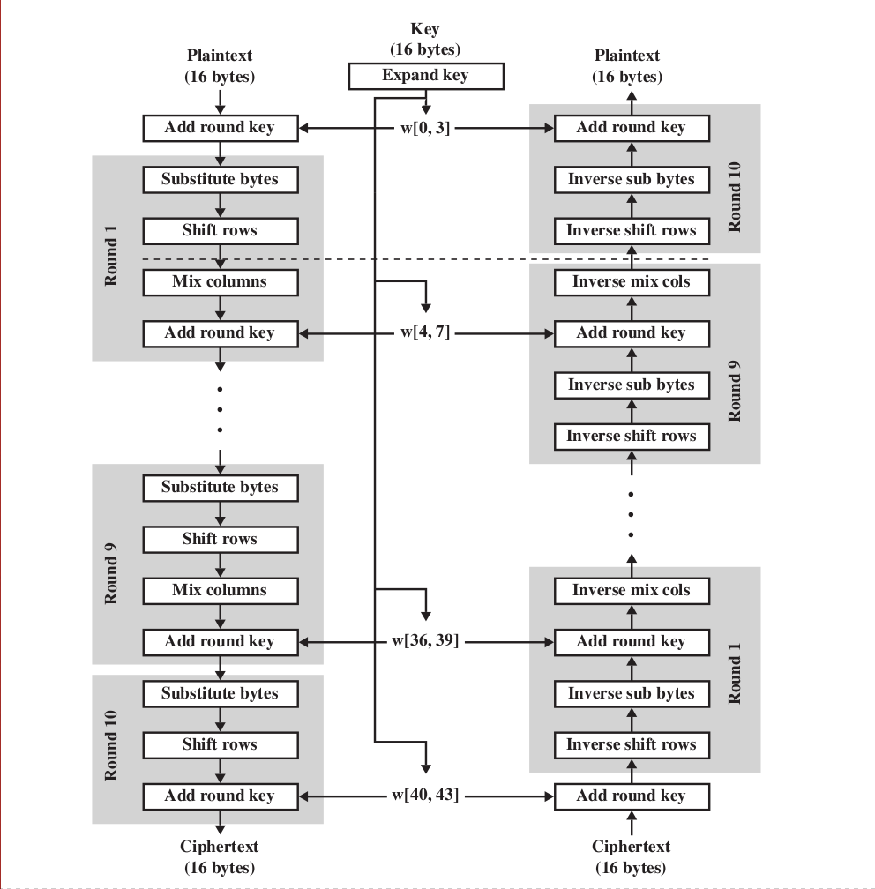
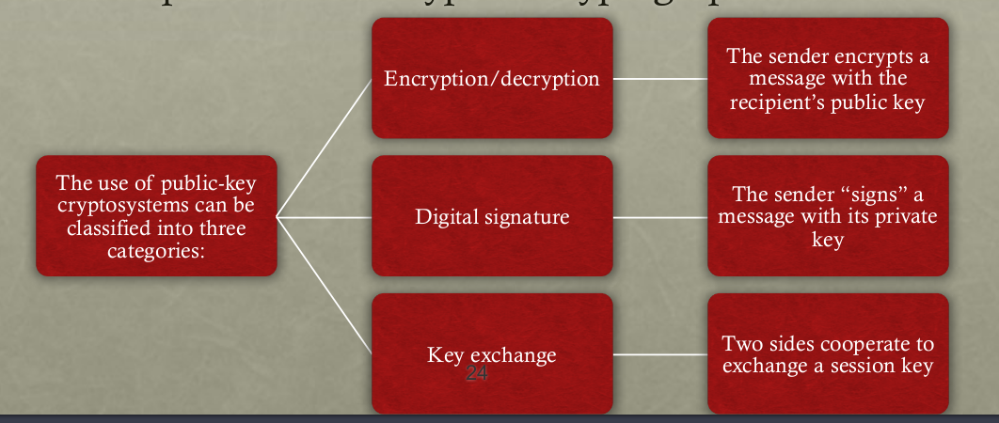

# Network Security
Spring 2018 <br />
Lecturer: Shiuhpyng Shieh <br />

## Ch2. Symmetric Encryption and Message Confidentiality
### RSA Encryption standard

* Asymmetric encryption standard.
This encryption standard mainly focus on prime factorisation
更多資訊可以參考[外星人的筆記]()
#### Course project1. Chosen cipher attack
* Will post report after the session of this homework ends.

### DES Encryption standard
* An encryption algorithm use round, permutation shift and XOR operation to generate the ciphertext.
* Divide the plaintext into 64-bit-long in size for each if the block, and use the same length key for encryption(actually the key is not in the same length since there are 8 bits used for the parity-checking during the encryption)

[Image src](https://www.youtube.com/watch?v=Sy0sXa73PZA)
[DES Briefly introduction](https://chaomengyang.wordpress.com/2008/02/08/des-vs-3des-vs-aes/)
* Prone to brute force attack since the key space is too small to guarantee the safe area, so the safer 3-DES algorithm is used nowadays.
* 16rounds are needed for the encryption process
* The encryption and decryption are run under the same algorithm but they are in the reverse order with each other
* This is a model based on the [Fiestel model](https://zh.wikipedia.org/wiki/%E8%B4%B9%E6%96%AF%E5%A6%A5%E5%AF%86%E7%A0%81), namely for the encryption and decryption they use the same function but in the reversed order.

### From DES to 3DES
* DES is not so secure since the key is 56bits long, which is quite prone to BF cryptanalysis
* 3DES lengthens the key of DES (56 * 3 = 168), doing DES 3 times to make the encryption safer.

 <br />
* Please feel free to refer to my classmate's [note](https://hackmd.io/AhM957LCSuCMNzq0b5c1fw#Cryptography) for more information

### AES Encryption standard
* Make a better encryption of 3DES, namely evolve from 3DES for a stronger and faster encryption algorithm.
* AES is still the same as the DES in the category of block cipher encryption, but the block size of AES is 128 bits, doubled of the DES encryption.
* 10 Rounds of encryption again and again is needed.
  <br /> Image source from textbook
One grey-coloured box is the one "round" of the encryption in AES<br />
Each of the round we take the preceding round's output as the input of this round and do the encryption again, with the following 4 tasks to be done<br />
1.The **Substitution Bytes** is to use the non-linear transform to let the input transformed with a "Affine transformation", making the encryption robust and hard to be cracked<br />
2.The **Shift Rows(Bit transposition)** is shifting the data, to rearrange the text, for row i we shift i-1 times to the left.<br />

<br /> Image source from wikipedia <br />
3.The **Mix Columns** is a linear transform under the mod multiplication <br />
4.The **Add Round Key** is let the input XOR with the Key in the current state. (Rijndael key generator solution,which is a subkey in each round, which we can be seen from the image provided above that Key(16 bytes and expand to match for each round, divided into 10 subkeys for 10 operations in AES encryption))<br />
5.After the aforementioned four steps are done, go to the next encryption box. The operation is bytewise<br />

### The truly random number and pseudo random number
* Applications of the random number
1.RSA pub-key generation and other pub-key algorithms.<br />
2.Session key for encryption in system such as Wi-Fi, e-mail<br />

<br /> Image source from wikipedia <br />

* The following 2 criteria are used to validate a sequence is random. <br />
1.Uniform distribution: The each element in the seed of random number must take the same proportion of being taken out.<br />
2.Independence: A sequence cannot be inferred from the other sequence, strictly and absolutely.<br />

### Block cipher vs Stream cipher

#### Stream cipher
* Change the encryption key from time to time, and each time the two part(sender-receiver) can generate the same random key s.t. they can encrypt and decrypt the same message.
The key of such encryption algorithm should have a extremely large period and as random as possible, o.w. it is crack-prone.<br />
In order to guard the BF attack, the longer key is preferred (However there is a trade-off b/w speed and security.)

As we can see the sender and receiver generate the same key for encryption and decryption.
Image source from textbook <br />
* RC4 Algorithm
1.An algorithm with changeable key length encryption. <br />
2.SSL TLS WEP WPA use this encryption algorithm<br />
3.Easy to implement in both HW ans SW, but terminated in 2015 due to attack<br />

RC4 Encryption procedure <br />
1.Shuffle the key, make it randomised.
```cpp
for i from 0 to 255
     S[i] := i
 endfor
 j := 0
 for( i=0 ; i<256 ; i++)
     j := (j + S[i] + key[i mod keylength]) % 256 //randomly take the new j and swap, make a permutation
     swap values of S[i] and S[j]
 endfor
```
2.Get even more shuffle data, each time for a input byte, locate the i and j value by take the value in the key, XOR the inputByte with the key (since the reverse of XOR operation is itself, once we insert the ciphertext we'll get plaintext, and converse is true as well.)
```cpp
i := 0
j := 0
while GeneratingOutput:
    i := (i + 1) mod 256   //a
    j := (j + S[i]) mod 256 //b
    swap values of S[i] and S[j]  //c
    k := inputByte ^ S[(S[i] + S[j]) % 256] //XOR operation suit for this case. Reverse operation also works
    output K
endwhile
```

#### Block cipher
* Use the same key for the text, and divide the text into blocks, processing ONE BLOCK for each time. Processing procedure including shift position, substitute text to let the plaintext look similar, however, generating the
totally different ciphertext for cryptographically secure. <br />

* The AES(128 bits per block), DES(64 bits per block), 3DES(64 bits per block) are lie in this category.<br />

* 5 Block modes for the block cipher, defined by NIST USA. Intended to use for the symmetric cipher.  .<br />

1.Electronic Code Book where Encryption:  ciphertext[i] = code_book[plaintext[i]] just. Need a decryptor to do reversed tasks.<br />
2.Cipher Block Chaining, take the step i's ciphertext XOR with next step's plaintext and encrypt again. **If there is a bit error in the ciphertext, it will cause the decryption of plaintext i and plaintext i+1 error since they are chained together from step to step.**<br />
 <br />
3.Cipher FeedBack , only the encryptor is needed, 2 times of encryption is equivalent to decryption.<br />
 <br />
4.CounTeR , use the counter directly for the key of encryption. Can be processed parallelly since each block can be processed with its counter and independent with other blocks, random access is suitable as well. And use the same key for decryption due to the properties of XOR operation, once the ciphertext XOR key ---> plaintext is decrypted.<br />
The CTR mode is both HW and SW efficiency (parallelism are able to implemented in both CPU and compiler, OS ...etc). <br/>
What's more, the preprocessing can be done as well, even without the presence of the plaintext, we can still generate the required key and the next task is just let plaintext XOR key ---> ciphertext.

5.Output FeedBack similar too Cipher FeedBack, take the ciphertext from previous round and encrypt again<br />

[Useful reference site ,MUST READ!!!](http://morris821028.github.io/2015/03/21/security-block-ciphers/#%E5%8A%A0%E5%AF%86%E8%A8%AD%E8%A8%88%E5%9F%BA%E7%A4%8E%E5%8E%9F%E5%89%87)


## Ch3. Message Authencation and Public Key Cryptography
### Message Authencation Code (MAC)
* Using some hash value of the data and encrypt that value at the end of data for validation (see the image below)
* Clarify!!: MAC cannot perform the data encryption, it can only be used for data authentication and validation. <br />
* Such as parity checking is also a kind of message authentication. <br />
 <br />
<br /> Image source from wikipedia <br />

### Secure Hash Functions
 <br />
1.Collision and preimage-found resistant, making it unable to do the reverse of hash to forge the data. <br />

### SHA Encryption standard
* Term explanation (waiting for the answer from OAlienO) <br />
1.Message Digest Size: Message digest, MD(same as MD of MD5), of how much data amount we output, such as in the following SHA1 algorithm, we produce 160bits output (hex * 40 = 160). <br />

2.Message Size: Message amount that we can process in one time(Maxium input).<br />
3.Block Size: In block cipher, cut all the message into several blocks, in the block is how much message in a block to be processed<br />
4.Word Size: A size of a given state.<br />

* The following are the Message digest from the SHA512.


### Hashing, Why and How?
[hash youtube](https://www.youtube.com/watch?v=yXmNmckX4sI) <br />

* Hash aims for reduce the huge amount of data to the small amount.
* Can be used for verify and prevent the errors in the communication.
* Evan a small change in the original plaintext (such as only a bit), it will cause the totally different hash value, this
result is called Avalanche Effect. It ensures the security of hash algorithm.
* Hash has to be one-way and pre image, collision-resistant, otherwise , data will be forged.
**Hash is doomed to be broken or cracked, what matters is that we have to try out best to lengthen the time before being cracked**

### Hash-based message authentication code (HMAC)
**Watch out the color correspondence for better understanding the procedure**


### Message encryption vs Message digestion(hashing), what is the difference?
[so encryption-vs-digest](https://stackoverflow.com/questions/3332662/encryption-vs-digest) <br />
[so how-is-an-md5-or-sha-x-hash-different-from-an-encryption](https://stackoverflow.com/questions/7574023/how-is-an-md5-or-sha-x-hash-different-from-an-encryption) <br />
[hash ,encryption and more](https://www.securityinnovationeurope.com/blog/page/whats-the-difference-between-hashing-and-encrypting) <br />
[so why-should-i-use-authenticated-encryption-instead-of-just-encryption](https://crypto.stackexchange.com/questions/12178/why-should-i-use-authenticated-encryption-instead-of-just-encryption) <br />

* Encryption: Really make the message secret, hard to be cracked and aims for security.
**key difference between encryption and hashing is that encrypted strings can be reversed back into their original decrypted form if you have the right key** ex. RSA AES DES ...
* Digestion (hashing): Digest the whole data, may be used for message authentication, producing an ID or FINGERPRINT of the input data.<br />
Hashing is great for usage in any instance where you want to **compare a value with a stored value, but can't store its plain representation for security reasons**. Other use cases could be checking the last few digits of a credit card match up with user input or comparing the hash of a file you have with the hash of it stored in a database to make sure that they're both the same. ex. MD5 SHA ...<br />
* Furthermore, if the digested data is encrypted, than it can be used for DIGITAL SIGNATURE.
1.For example in SHA family **能計算出一個數位訊息所對應到的，長度固定的字串（又稱訊息摘要）的演算法。且若輸入的訊息不同，它們對應到不同字串的機率很高。**
**OAlienO : SHA 不是加密因為他沒辦法解回原本的 input**

### Authenticated encryption
* A term used to describe encryption systems that simultaneously protect confidentiality and authenticity of communications.
* Compared with traditional encryption, the authenticated encryption  additionally provides authenticity, while plain encryption provides only confidentiality.
* Usually more complicated than confidentiality-only or authenticity-only schemes.


### Public key cryptography
* Encrypt with public key: Want to send someone a message that only they(certain of groups,...etc) will be able to read, encrypt it with that person's public key.
* Encrypt with private key: Want to publish some information and guarantee that you're the author **(Reason is that the only person who encrypt with HIS PRIVATE KEY CAN ONLY BE THE ORGINAL AUTHOR, and everyone can use the public related to that private key to decrypt it)**, and that it hasn't been tampered with, then you encrypt it with your private key.(We can as well use the authenticated encryption to ensure the authenticity. Just like the aforementioned **Digital signature**)

[so What is we encrypt with private key??](https://stackoverflow.com/questions/16405240/encrypt-message-with-private-key)
**All the pics , images credits to the original author, I only use it for the education purpose, please DO NOT distribute**
### Private key vs Secret key, what is the difference?
* Private key: Use in asymmetric encryption.
* Secret key: Use in symmetric encryption, but it is quite hard for us (or say unsafe) to exchange secret key, so the Diffie Hellman key exchange algorithm is invented.

### Diffie Hellman key exchange
* A way to exchange the secret key via an unsafe path

[Math theory behind this algorithm](https://www.youtube.com/watch?v=Yjrfm_oRO0w)

* SSL, TLS, SFTP use it. Like the AES implemetation AES is symmetric encryption and a shared-secret-key exchange is needed for end-to-end data encryption.
* Both of end to end does not need to know each other (or cant break) his / her provate key but share a same secret key to do secret data exchange.
* In this algorithm, we should choose a very big a, b and p s.t. Bob is unable so solve 'a' of Alice's secret and neither is Alice. o.w. Eve will hack into it and solve the shared secret key.
* Aside from the RSA, why use Diffie Hellman key exchange? <br />
Since the process of RSA is quite burdensome (numbers in it are extremely huge) so if we can back to the traditional symmetric encryption such as AES (just now we need a "secure pipe" under the "insecure pipe") to perform key exchange.
Than the end-to-end encryption can be achieved, what's more, this method is faster in which stream cipher are performed

### Man in the middle attack (MITM)
* The MITM forges the key of both side and deceives them, act as both fake Alice and Bob.

And the wikipedia analogy ,note: sequence different from the image<br />

The core idea about this is still the mathematical expression, for example for the secret key K1, since Darth intercepts the message, then he can forge the key with his secret key XD2 ,due to the following mathematical theory about modulo exponential.<br />

So Alice is able to acquire the secret key via her own private key XA due to the upper math theory. **BUT SHE DOES NOT KNOW THAT YD2 ACTUALLY COMES FROM DARTH and DARTH now share the same key with Alice, so Alice thinks that Darth is Bob!!**
