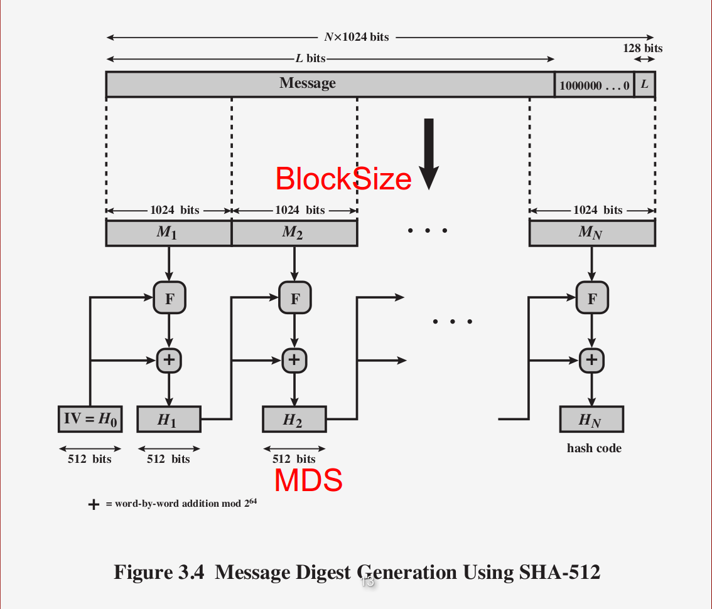
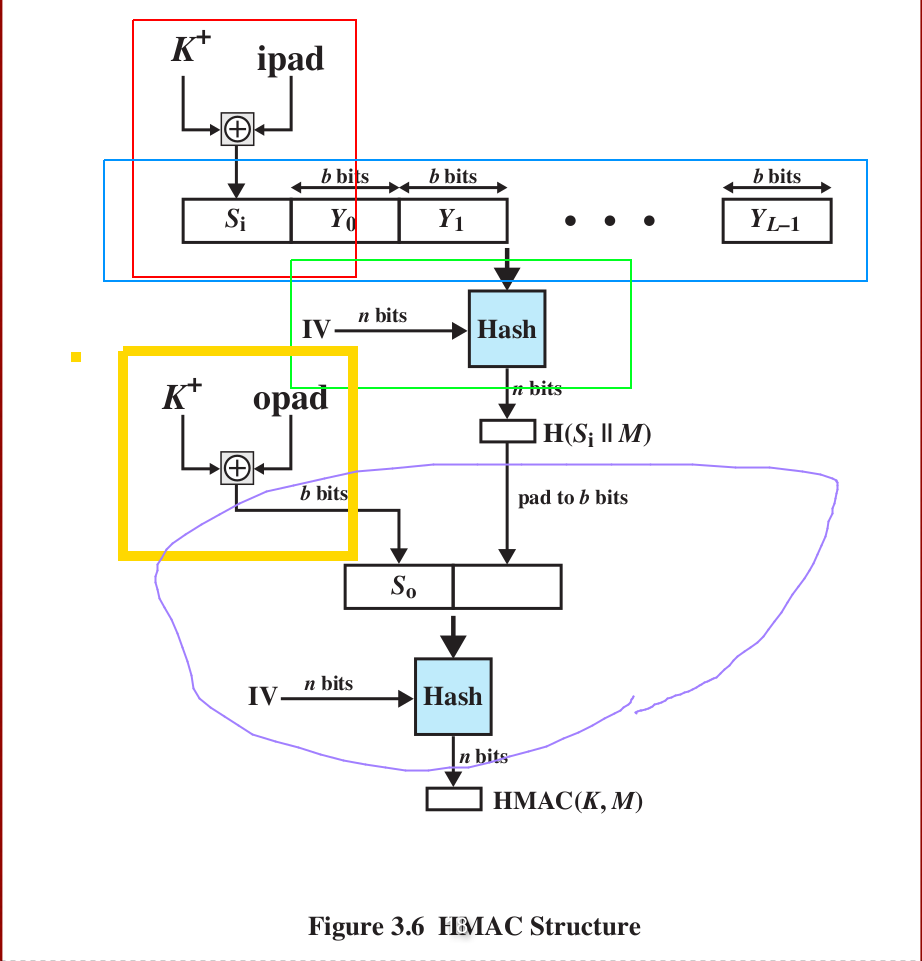
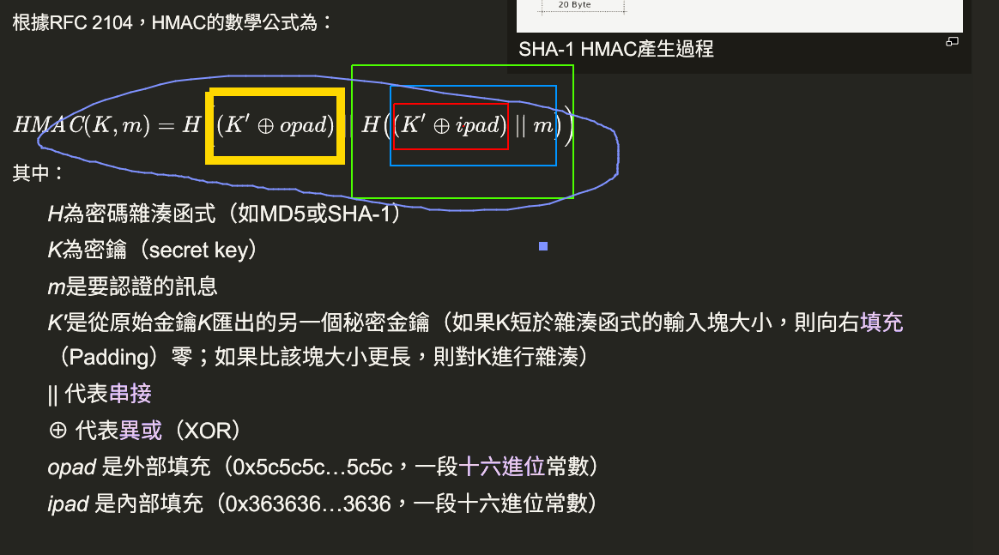
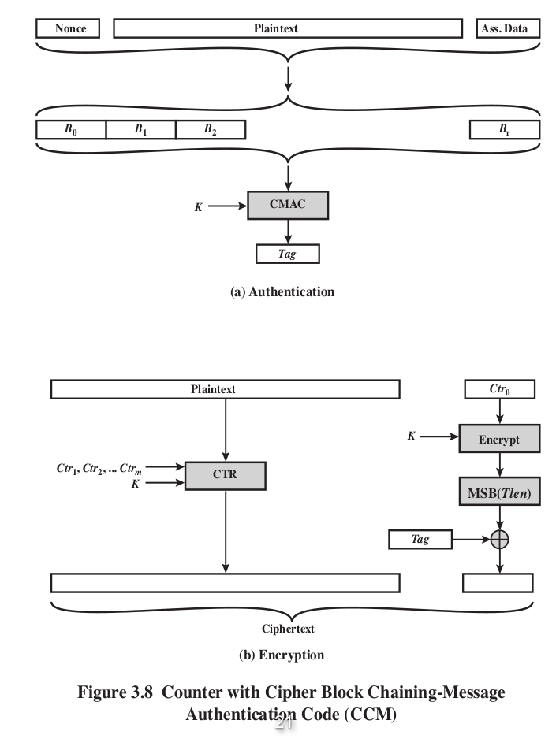
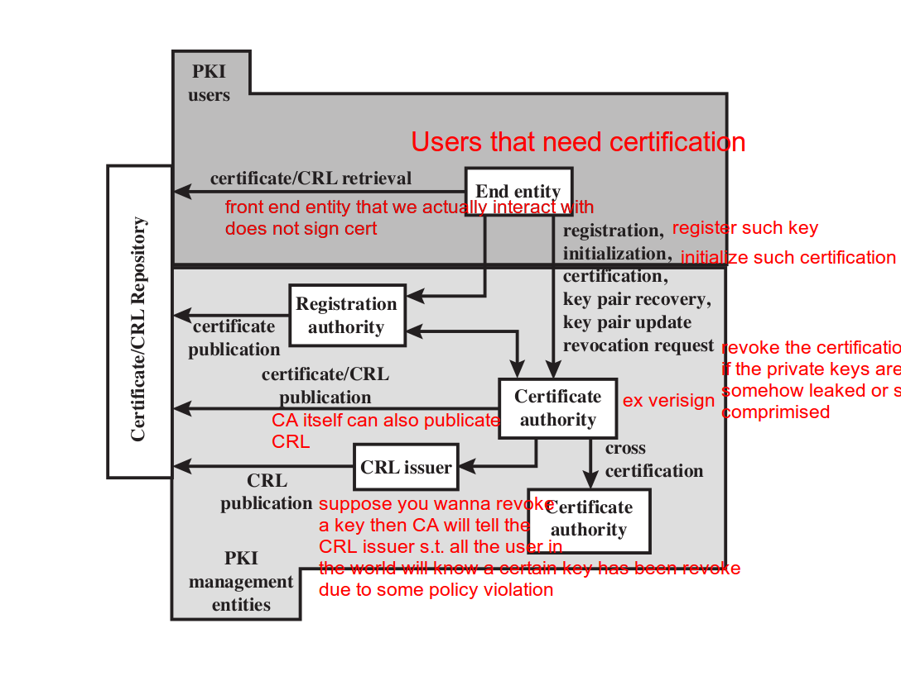
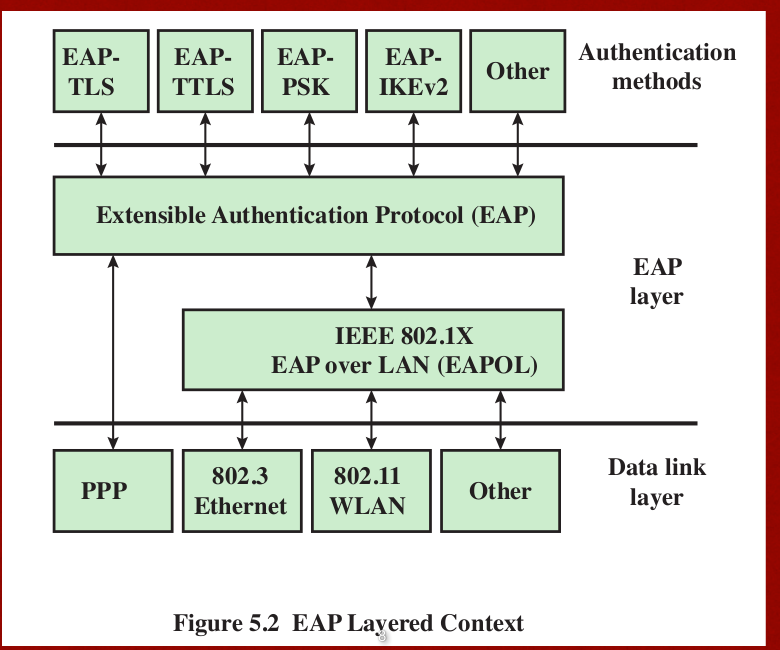
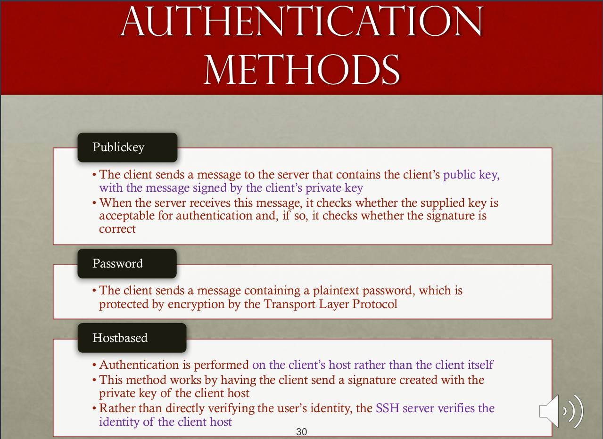
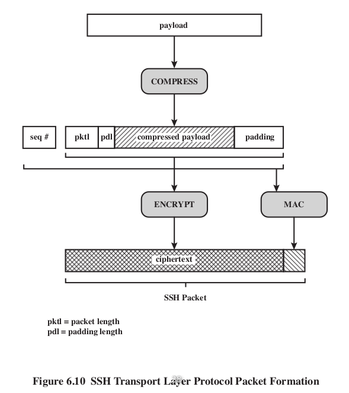
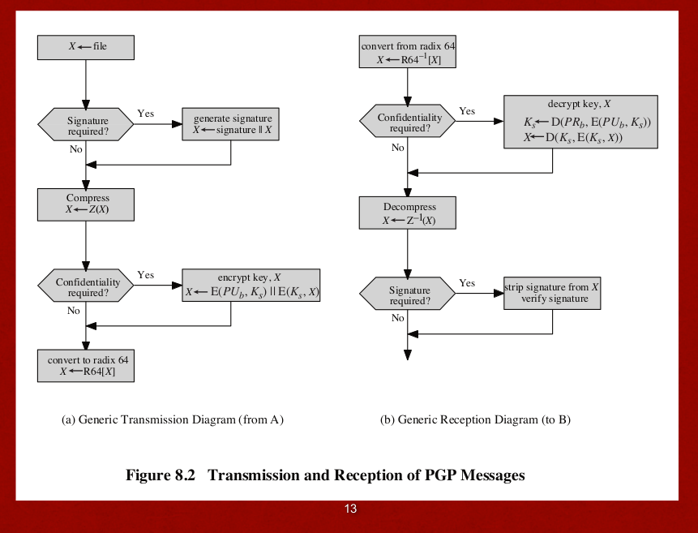

# Network Security
Spring 2018 <br />
Lecturer: Shiuhpyng Shieh @CS, NCTU Taiwan<br />
## Ch1. Introduction.

## Ch2. Symmetric Encryption and Message Confidentiality

### Concept correction here:
* Assymetric encryption is not necessarily and absolutely better than the symmetric encryption, they can work with each other.

### Common type of the cryptanalysis

#### Brute force attack
* On avg, half of the keys have to be tested.
#### Ciphertext only attack
* Known the encryption algorithm
* Want to collect all the ciphtertext to find out the plaintext or ultimately, find out what the key is.
#### Known plaintext attack
* Use the known plaintext and the correspond ciphertext which encrypted by the encryption algorithm and ultimately find out what the key is.   

#### Chosen plaintext attack
* Use the dedicatedly and carefully crafted plaintext, figuring out the characteristics about the algorithm and ultimately find out what the key is.
##### Difference b/w known plaintext and chosen ciphertext
[See here](https://crypto.stackexchange.com/questions/2846/what-is-the-difference-between-known-plaintext-attack-and-chosen-plaintext-attac)

#### Chosen ciphertext attack
* As we've done in the course project 1, we use the dedicatedly and carefully crafted plaintext, figuring out the characteristics about the algorithm and ultimately find out what the key is.

### Feistel cipher architecture
*
### Model of symmetric encryption
* Encrypt and decrypt with the same key, the key should be shared through a secure manner.

* security of symmetric encryption depends on the secrecy of the key, not the secrecy of the algorithm, which means we should
keep the secret key as safe as possible.

### RSA Encryption standard

* Asymmetric encryption standard.

This encryption standard mainly focus on prime factorisation
更多資訊可以參考[外星人的筆記](https://oalieno.github.io/crypto/asymmetric/rsa/introduction/)
#### Course project1. Chosen cipher attack
* Will post report after the session of this homework ends.

### DES Encryption standard
* An encryption algorithm use round, permutation shift and XOR operation to generate the ciphertext.
* Divide the plaintext into 64-bit-long in size for each if the block, and use the same length key for encryption(actually the key is not in the same length since there are 8 bits used for the parity-checking during the encryption)

[Image src](https://www.youtube.com/watch?v=Sy0sXa73PZA)
[DES Briefly introduction](https://chaomengyang.wordpress.com/2008/02/08/des-vs-3des-vs-aes/)
* Prone to brute force attack since the key space is too small to guarantee the safe area, so the safer 3-DES algorithm is used nowadays.
* 16rounds are needed for the encryption process
* The encryption and decryption are run under the same algorithm but they are in the reverse order with each other
* This is a model based on the [Fiestel model](https://zh.wikipedia.org/wiki/%E8%B4%B9%E6%96%AF%E5%A6%A5%E5%AF%86%E7%A0%81), namely for the encryption and decryption they use the same function but in the reversed order.

### From DES to 3DES
* DES is not so secure since the key is 56bits long, which is quite prone to BF cryptanalysis
* 3DES lengthens the key of DES (56 * 3 = 168), doing DES 3 times to make the encryption safer.
 <br />

* Please feel free to refer to my classmate's [note](https://hackmd.io/AhM957LCSuCMNzq0b5c1fw#Cryptography) for more information
* For encryption procedure:
P--E(K1)--A--D(K2)--B--E(K3)-->C <br />
C--D(K1)--B--E(K2)--A--D(K3)-->A <br />
Since the Fiestel architecture, the encryption and decryption method are just the reverse of each other.
* For decryption procedure:

### AES Encryption standard
* Make a better encryption of 3DES, namely evolve from 3DES for a stronger and faster encryption algorithm.
* AES is still the same as the DES in the category of block cipher encryption, but the block size of AES is 128 bits, doubled of the DES encryption.
* 10 Rounds of encryption again and again is needed.
  <br /> Image source from textbook
One grey-coloured box is the one "round" of the encryption in AES<br />
Each of the round we take the preceding round's output as the input of this round and do the encryption again, with the following 4 tasks to be done<br />
1.The **Substitution Bytes** is to use the non-linear transform to let the input transformed with a "Affine transformation", making the encryption robust and hard to be cracked<br />
2.The **Shift Rows(Bit transposition)** is shifting the data, to rearrange the text, for row i we shift i-1 times to the left.<br />

<br /> Image source from wikipedia <br />
3.The **Mix Columns** is a linear transform under the mod multiplication <br />
4.The **Add Round Key** is let the input XOR with the Key in the current state. (Rijndael key generator solution,which is a subkey in each round, which we can be seen from the image provided above that Key(16 bytes and expand to match for each round, divided into 10 subkeys for 10 operations in AES encryption))<br />
5.After the aforementioned four steps are done, go to the next encryption box. The operation is bytewise<br />

### The truly random number and pseudo random number
* Applications of the random number<br />
1.RSA pub-key generation and other pub-key algorithms.<br />
2.Session key for encryption in system such as Wi-Fi, e-mail<br />

<br /> Image source from wikipedia <br />

* The following 2 criteria are used to validate a sequence is random. <br />
1.Uniform distribution: The each element in the seed of random number must take the same proportion of being taken out.<br />
2.Independence: A sequence cannot be inferred from the other sequence, strictly and absolutely.<br />

### Block cipher vs Stream cipher

#### Stream cipher
* Change the encryption key from time to time, and each time the two part(sender-receiver) can generate the same random key s.t. they can encrypt and decrypt the same message.
The key of such encryption algorithm should have a extremely large period and as random as possible, o.w. it is crack-prone.<br />
In order to guard the BF attack, the longer key is preferred (However there is a trade-off b/w speed and security.)

As we can see the sender and receiver generate the same key for encryption and decryption.
Image source from textbook <br />
* RC4 Algorithm<br />
1.An algorithm with changeable key length encryption. <br />
2.SSL TLS WEP WPA use this encryption algorithm<br />
3.Easy to implement in both HW ans SW, but terminated in 2015 due to attack<br />

RC4 Encryption procedure <br />
1.Shuffle the key, make it randomised.
```cpp
for i from 0 to 255
     S[i] := i
 endfor
 j := 0
 for( i=0 ; i<256 ; i++)
     j := (j + S[i] + key[i mod keylength]) % 256 //randomly take the new j and swap, make a permutation
     swap values of S[i] and S[j]
 endfor
```
2.Get even more shuffle data, each time for a input byte, locate the i and j value by take the value in the key, XOR the inputByte with the key (since the reverse of XOR operation is itself, once we insert the ciphertext we'll get plaintext, and converse is true as well.)
```cpp
i := 0
j := 0
while GeneratingOutput:
    i := (i + 1) mod 256   //a
    j := (j + S[i]) mod 256 //b
    swap values of S[i] and S[j]  //c
    k := inputByte ^ S[(S[i] + S[j]) % 256] //XOR operation suit for this case. Reverse operation also works
    output K
endwhile
```

#### Block cipher
* Use the same key for the text, and divide the text into blocks, processing ONE BLOCK for each time. Processing procedure including shift position, substitute text to let the plaintext look similar, however, generating the
totally different ciphertext for cryptographically secure. <br />

* The AES(128 bits per block), DES(64 bits per block), 3DES(64 bits per block) are lie in this category.<br />

* 5 Block modes for the block cipher, defined by NIST USA. Intended to use for the symmetric cipher.  .<br />

1.Electronic Code Book where Encryption:  ciphertext[i] = code_book[plaintext[i]] just. Need a decryptor to do reversed tasks.<br />
2.Cipher Block Chaining, take the step i's ciphertext XOR with next step's plaintext and encrypt again. **If there is a bit error in the ciphertext, it will cause the decryption of plaintext i and plaintext i+1 error since they are chained together from step to step.**<br />
 <br />
3.Cipher FeedBack , only the encryptor is needed, 2 times of encryption is equivalent to decryption (Reason: ).<br />
 <br />
4.CounTeR , use the counter directly for the key of encryption. Can be processed parallelly since each block can be processed with its counter and independent with other blocks, random access is suitable as well. And use the same key for decryption due to the properties of XOR operation, once the ciphertext XOR key ---> plaintext is decrypted.<br />
The CTR mode is both HW and SW efficiency (parallelism are able to implemented in both CPU and compiler, OS ...etc). <br/>
What's more, the preprocessing can be done as well, even without the presence of the plaintext, we can still generate the required key and the next task is just let plaintext XOR key ---> ciphertext.

5.Output FeedBack similar too Cipher FeedBack, take the ciphertext from previous round and encrypt again<br />

[Useful reference site ,MUST READ!!!](http://morris821028.github.io/2015/03/21/security-block-ciphers/#%E5%8A%A0%E5%AF%86%E8%A8%AD%E8%A8%88%E5%9F%BA%E7%A4%8E%E5%8E%9F%E5%89%87)


## Ch3. Message Authencation and Public Key Cryptography
### Message Authencation Code (MAC)
* Using some hash value of the data and encrypt that value at the end of data for validation (see the image below)
* Clarify!!: MAC cannot perform the data encryption, it can only be used for data authentication and validation. <br />
* Such as parity checking is also a kind of message authentication. <br />
 <br />
<br /> Image source from wikipedia <br />

### Secure Hash Functions
 <br />
1.Collision and preimage-found resistant, making it unable to do the reverse of hash to forge the data. <br />

### Hash collision, strong vs weak
#### Strong
Given an arbitrary x there exists no x' with x' != x so that h(x) = h(x')
(更厲害，無法找到任取兩個產生相同雜湊數值)
#### Weak
There exist no given x, and will be infeasible to find x' with x != x' so that h(x) = h(x') (一個已知找無法找到另一個產生相同數值的雜湊)


### SHA Note, NOT AN Encryption standard!
* Term explanation (waiting for the answer from OAlienO) <br />
1.Message Digest Size: Message digest, MD(same as MD of MD5), of how much data amount we output, such as in the following SHA1 algorithm, we produce 160bits output (hex * 40 = 160). <br />

2.Message Size: Message amount that we can process in one time(Maxium input).<br />
3.Block Size: In block cipher, cut all the message into several blocks, in the block is how much message in a block to be processed<br />
4.Word Size: A size of a given state.<br />

* The following are the Message digest from the SHA512.


### Hashing, Why and How?
[hash youtube](https://www.youtube.com/watch?v=yXmNmckX4sI) <br />

* Hash aims for reduce the huge amount of data to the small amount.
* Can be used for verify and prevent the errors in the communication.
* Evan a small change in the original plaintext (such as only a bit), it will cause the totally different hash value, this
result is called Avalanche Effect. It ensures the security of hash algorithm.
* Hash has to be one-way and pre image, collision-resistant, otherwise , data will be forged.
**Hash is doomed to be broken or cracked, what matters is that we have to try out best to lengthen the time before being cracked**

### Hash-based message authentication code (HMAC)
**Watch out the color correspondence for better understanding the procedure**


### HMAC vs CMAC??
[so hmac vs cmac](CMAC.png)
* AS we can see from the picture for HMAC (aforementioned) and CMAC, although both of them use the key, but in

### Message encryption vs Message digestion(hashing), what is the difference?
[so encryption-vs-digest](https://stackoverflow.com/questions/3332662/encryption-vs-digest) <br />
[so how-is-an-md5-or-sha-x-hash-different-from-an-encryption](https://stackoverflow.com/questions/7574023/how-is-an-md5-or-sha-x-hash-different-from-an-encryption) <br />
[hash ,encryption and more](https://www.securityinnovationeurope.com/blog/page/whats-the-difference-between-hashing-and-encrypting) <br />
[so why-should-i-use-authenticated-encryption-instead-of-just-encryption](https://crypto.stackexchange.com/questions/12178/why-should-i-use-authenticated-encryption-instead-of-just-encryption) <br />

* Encryption: Really make the message secret, hard to be cracked and aims for security.
**key difference between encryption and hashing is that encrypted strings can be reversed back into their original decrypted form if you have the right key** ex. RSA AES DES ...
* Digestion (hashing): Digest the whole data, may be used for message authentication, producing an ID or FINGERPRINT of the input data.<br />
Hashing is great for usage in any instance where you want to **compare a value with a stored value, but can't store its plain representation for security reasons**. Other use cases could be checking the last few digits of a credit card match up with user input or comparing the hash of a file you have with the hash of it stored in a database to make sure that they're both the same. ex. MD5 SHA ...<br />
* Furthermore, if the digested data is encrypted, than it can be used for DIGITAL SIGNATURE.
1.For example in SHA family **能計算出一個數位訊息所對應到的，長度固定的字串（又稱訊息摘要）的演算法。且若輸入的訊息不同，它們對應到不同字串的機率很高。**
**OAlienO : SHA 不是加密因為他沒辦法解回原本的 input**

### Authenticated encryption (HMAC x CMAC x  CCM = CMAC + AES block cipher + CTR block mode)
* A term used to describe encryption systems that simultaneously protect confidentiality and authenticity of communications.
* Compared with traditional encryption, the authenticated encryption  additionally provides authenticity, while plain encryption provides only confidentiality.
* Usually more complicated than confidentiality-only or authenticity-only schemes.


### Public key cryptography
* Encrypt with public key: Want to send someone a message that only they(certain of groups,...etc) will be able to read, encrypt it with that person's public key.
* Encrypt with private key: Want to publish some information and guarantee that you're the author **(Reason is that the only person who encrypt with HIS PRIVATE KEY CAN ONLY BE THE ORGINAL AUTHOR, and everyone can use the public related to that private key to decrypt it)**, and that it hasn't been tampered with, then you encrypt it with your private key.(We can as well use the authenticated encryption to ensure the authenticity. Just like the aforementioned **Digital signature**)

[so What is we encrypt with private key??](https://stackoverflow.com/questions/16405240/encrypt-message-with-private-key)
### Private key vs Secret key, what is the difference?
* Private key: Use in asymmetric encryption.
* Secret key: Use in symmetric encryption, but it is quite hard for us (or say unsafe) to exchange secret key, so the Diffie Hellman key exchange algorithm is invented.

### Diffie Hellman key exchange
* A way to exchange the secret key via an unsafe path

[Math theory behind this algorithm](https://www.youtube.com/watch?v=Yjrfm_oRO0w)

* SSL, TLS, SFTP use it. Like the AES implemetation AES is symmetric encryption and a shared-secret-key exchange is needed for end-to-end data encryption.
* Both of end to end does not need to know each other (or cant break) his / her private key but share a same secret key to do secret data exchange.
* In this algorithm, we should choose a very big a, b and p s.t. Bob is unable so solve 'a' of Alice's secret and neither is Alice. o.w. Eve will hack into it and solve the shared secret key.
* Aside from the RSA, why use Diffie Hellman key exchange? <br />
Since the process of RSA is quite burdensome (numbers in it are extremely huge) so if we can back to the traditional symmetric encryption such as AES (just now we need a "secure pipe" under the "insecure pipe") to perform key exchange.
Than the end-to-end encryption can be achieved, what's more, this method is faster in which stream cipher are performed

### Man in the middle attack (MITM)
* The MITM forges the key of both side and deceives them, act as both fake Alice and Bob.

And the wikipedia analogy ,note: sequence different from the image<br />

The core idea about this is still the mathematical expression, for example for the secret key K1, since Darth intercepts the message, then he can forge the key with his secret key XD2 ,due to the following mathematical theory about modulo exponential.<br />

 <br />
So Alice is able to acquire the secret key via her own private key XA due to the upper math theory. **BUT SHE DOES NOT KNOW THAT YD2 ACTUALLY COMES FROM DARTH and DARTH now share the same key with Alice, so Alice thinks that Darth is Bob!! and the same is true for Bob!!** <br />
Originally the shared secret key should be lie on the mathematical expression like this<br />
 <br />
Rather than this <br />
 <br />

## Ch.4 Key Distribution and User Authentication

### Key distribution
* Used in the symmetric key crypto system to exchange keys from one end point to another.

### Kerberos and its components
* User password will not be transmitted but will be used as a shared secret for the authentication
* Centralised key distribution and authentication service b/w user and server(3rd party) that relies on symmetric encryption (No public key in it)
* Generates a symmetric secret key b/w two end points.
* Distributed system makes computing power better.
* During the key's lifetime (embedded in the message), the key can be used again and again.
* **Central idea relies on the trustworthy 3RD PARTY SERVER**
#### Authencation server (AS)
* Authenticate the user
#### Ticket granting server (TGS)
* Grant authenticated user permissions to act with the real server (SS, Service Server)
[wikipedia for detailed procedure](https://zh.wikipedia.org/wiki/Kerberos) <br />
[Detailed explanation video](https://www.youtube.com/watch?v=kp5d8Yv3-0c) <br />

### Timestamp portocal vs Challenge-Response Portocal

#### Timestamp portocal
* Record the timestamp of each data transaction.
* Prone to replay attack(a kind of MITM attack) if the clocks b/w the client and server is not synchronised
But how come will this happen?? <br />
If the system time is not synchronised, then suppose the end point EA is slower, then the MITM can intercept the message b/w two endpoint and resend the password again to hack and pretend to be the genuine user. What's more, since the time is slower in EA, then as the MITM intercepts data and resend, it does need some time to "RETRANSMIT" , but it is the slower time that allows the delay of retransmit time not be discovered if the time difference |T_received - T_send| < epsilon is not so strict.

#### Challenge-Response Portocal
* [Reference this video first!](https://www.youtube.com/watch?v=19CE1yeKzjU)
* The server and the receiver share a certain kind of "shared secret" that might be generated as the user registered in the system.
* Ensures the "Mutual Authentication"
* The procedure as follows:
Server sends a unique challenge value sc to the client<br />
Client sends a unique challenge value cc to the server<br />
Server computes sr = hash(cc + secret) and sends to the client<br />
Client computes cr = hash(sc + secret) and sends to the server<br />
Server calculates the expected value of cr and ensures the client responded correctly<br />
Client calculates the expected value of sr and ensures the server responded correctly
where<br />
sc is the server generated challenge<br />
cc is the client generated challenge<br />
cr is the client response<br />
sr is the server response<br />
* Since the secret is shared b/w the server and client, then is is able to verify the genuine of both server and client  
* A good challenge/response system will generate a new challenge for every transaction or session (and make sure that previous challenges are not reused!), so that session transcripts cannot be spliced together to create new fraudulent systems. (Maybe the challenge will be encrypted in both parties)

### Comparison b/w Kerberos v4 and Kerberos v5
[Reference here](http://www.differencebetween.info/difference-between-kerberos-v4-and-kerberos-v5)

* v4 is prone to MITM attack and v5 is not.
* Both of them provides mutual authentication

### What is mutual authentication and why we need it??
* 疑問：Mutual authentication 相較於 one way 他的好處是 可以同時驗證 伺服器方和使用者方嘛？？
就是伺服器能確認這個user 而且使用者也可以確認這個server
但是原本只有usr來確認server
多出這個server來確認usr 會有什麼優點呢？
解答：因為user和server都有可能被仿冒，因此需要雙重認證雙方。

* Both the server and client may be inpersonated, so we need to verify their real identification.

### Key distribution with asymmetric encryption (Public key certificate)
* The well known SSL use this method ,and the X.509 standard is used.
* Aimed to solve the problem that we want to verify the authentication of some authorities by the trusted certificated authority (CA)
* Step as follows

* Verify the signature that generated by CA to ensure the reality.

### What is the difference b/w the digital signature and public key authentication.
* From stackoverflow:
A digital signature is used to verify a message. It is basically an encrypted hash (encrypted by the private key of the sender) of the message. The recipient can check if the message was tampered with by hashing the received message and comparing this value with the decrypted signature (decrypted the signature with the public key from the sender).

To decrypt the signature, the corresponding public key is required. **A digital certificate is used to bind public keys to persons or other entities. If there were no certificates, the signature could be easily be forged, as the recipient could not check if the public key belongs to the sender.**

[Original discussion thread ](https://stackoverflow.com/questions/2882506/what-is-the-difference-between-digital-signature-and-digital-certificate) <br />
[Similar reference](http://support.unethost.com/knowledgebase.php?action=displayarticle&id=82) <br />

* The "Chain of Trust" SSL certificate, root certificate are all related to this topic **Actually the public key certification (certification distribution of authorize a genuine key) is the core concept of SSL/TLS portocal**
[Chain of Trust YouTube video](https://www.youtube.com/watch?v=heacxYUnFHA)
* Private key of root CA should be absolutely inaccessible.
* Once the "Chain of Trust" is successfully formed, an secure communication path can be formed (TLS using SSL certificate to do such things)
#### So a question comes to my mind, **What is the differenct b/w HTTPS,TLS and SSL?**
* Answer as follows:
1.TLS is just the new name (or say acronym) of SSL Namely, SSL protocol got to version 3.0; TLS 1.0 is "SSL 3.1". TLS versions currently defined include TLS 1.1 and 1.2. Each new version adds a few features and modifies some internal details. We sometimes say "SSL/TLS".<br />

2.HTTPS is the HTTP under the secured transmission protocol, i.e. HTTPS is HTTP-within-SSL/TLS. SSL (TLS) establishes a secured, bidirectional tunnel for arbitrary binary data between two hosts.<br />

### Why chain of trust??
* Even though the asymmetric (Public-key cryptography RSA) can ensure the secret communication, digital signature can ensure the correctness of content
, however, we are still not sure about whether the issuer of the digital certificate is the real "good guy" or the "forged guy."
[wikipedia ref](https://zh.wikipedia.org/wiki/%E4%BF%A1%E4%BB%BB%E9%8F%88)
### PKI, CA, Key...etc great explanation video
[Here](https://www.youtube.com/watch?v=i-rtxrEz_E8)

* A public key infrastructure (PKI) is a set of roles, policies, and procedures needed to create, manage, distribute, use, store, and revoke digital certificates and manage public-key encryption.

### When to revoke a user's certification??
* The user’s private key is assumed to be compromised(假定被洩漏出去了)
* The user is no longer certified by this CA; reasons for this
include subject’s name has changed, the certificate is
superseded, or the certificate was not issued in conformance
with the CA’s policies
* The CA’s certificate is assumed to be compromised

### The PKI architecture

[PKI YouTube video](https://www.youtube.com/watch?v=t0F7fe5Alwg)
* PKI is a framework that some vendor and use...etc should follow, and PKI associates a public key with a verified person/system.


## Ch.5 Cloud Security
### 802.1X, EAP(A framework)
* Used to control the access of user to the internet.
* provides a generic transport service for the
exchange of authentication information between a
client system and an authentication server.<br />
* The authentication server gives the instruction to the gate / authenticator such that it can give the client the internet resource he wants or not.
*  , auth methods through the EAP layer to reach the data link layer.
* Procedure as follows <br />
1.EAPOL(OL stands for data encapsulation)-Start, start the eap<br />
2.EAPOL(OL stands for data encapsulation)-EAP(REQ/IDENTITY) auth server wants to know the identity />
3.EAPOL(OL stands for data encapsulation)-EAP(RESPONSE/AUTH) five the clinet response<br />
4.EAPOL(OL stands for data encapsulation)-Logoff end the connection<br />
### Cloud Couputing
* Definition: Focus on what service cloud should have rather than a "how to" design architecture. a tool for
describing, discussing, and developing a system-specific
architecture using a common framework of reference.
* SaaS provides software such as google drive, PaaS manages the computing platform such as the web(middleware components), and IaaS provides the
hardware resources such as the network server and hosts...etc
* Roles in cloud computing. <br />
1.Carrier: Provide the transport b/w cloud services and consumers<br />
2.Auditor(稽查員): Assures that THE CP conforms to a certain cloud standards<br />
3.Broker(經紀人):Help the consumer to manage the cloud service when it is too complicated.<br />
### Data protection in the cloud
* Multi instance model: Am unique DBMS in each could subscriber(Risk distribution)
* Multi tenant model: Allows customers to share computing resources in a public or private cloud. Each tenant's data is isolated and remains invisible to other tenants.
**The rest of cloud computing will be read before the midterm 2**
## Ch.6 Transport-Level Security
### SSL Architecture
* SSL connection: each connection is transient , and associated with one session.
* SSL session: Association b/w the client and the server
[wikipedia](https://zh.wikipedia.org/wiki/%E5%82%B3%E8%BC%B8%E5%B1%A4%E5%AE%89%E5%85%A8%E6%80%A7%E5%8D%94%E5%AE%9A)
[NetAdmin](http://www.netadmin.com.tw/article_content.aspx?sn=1106140008)
### SSL Record Portocol
* Confidentiality with Handshake protocol to ensure that no one intercept in the pipeline, encrypt the data with secret key.
* Message integrity: With a shared secret key to ensure the MAC code
such that we may check whether the data has been modified or not.

### Pre master, master secret, private, shared / session key
* Pre master key: Allow for the uniform format of the master key.(Aim for the greater consistency)
* Master key is the agreement of both endpoint, master_secret = PRF(pre_master secret, "master secret"(aims for tag of current thing), Client ran + Server ran (or the Alice ran add up with the Bob ran))
[Check here](https://crypto.stackexchange.com/questions/27131/differences-between-the-terms-pre-master-secret-master-secret-private-key)

### Cryptographic Computations

### TLS, HTTPS = HTTP + SSL/TLS HTTP under a secure transport layer
* Port 443 will be used since it invokes the SSL
* The normal HTTP close we just need HTTP close, while the HTTPS we need the TLS which involves the underlying TCP connection.
* TLS requires the two entity of TCP in both client and server side.
* TLS should agree and exchange the closure alerts before closing connection.
### SSH
* Cryptographic network protocol
* 3different protocol: User authentication, Connection and Transport Layer Protocol
* Using the asymmetric encryption for user authentication(identify the private key of the user ti ensure the user is really him).
* Authentication method

* Package spec


### SSH Channel types
* Including Session (Remotely execute a command such like ssh afhwu0329@linux1.cs.nctu.edu.tw), X11 , Forwarded TCPIP(Remote Port Forwarding) Direct(Local PF)

### Port Forwarding
[SSHPF](https://gwokae.mewggle.com/wordpress/2010/08/%E5%88%A9%E7%94%A8ssh-tunnel%E9%80%A3%E7%B7%9A%E8%87%B3%E5%85%A7%E9%83%A8%E7%B6%B2%E8%B7%AF/)
* Useful features of SSH
* Insecure TCP -> SSH (Change the port from TCP to SSH)
* SSH force the traffic in the TCP change to the SSH layer.
* [Local vs Remote PF](https://blog.fundebug.com/2017/04/24/ssh-port-forwarding/)

* Local vs Remote ??
1.Local 自己連向更遠端的伺服器，從自己的角度看將自己的a埠經由ssh隧道連向（轉發導向）遠端remote server的b埠，藉由remote server傳到更遠端的faraway host<br />
2.Remote 當遠端伺服器想要連回來時，從自己的角度看將遠端的a埠經由ssh隧道連向（轉發導向）我這端local server的b埠，藉由local server連向我一旁的near host<br />

## Ch.7 Wireless Security
* Wireless devices are tend to have higher security risks than others since the following factors: Channel, Mobility, Resources, Accessibility.
* Common Wireless Network Threats: Accidental association, Malicious association, AD-HOC Networks, Identity theft(MAC Spoofing), MITM attack, DoS, Network injection.

### Protect against wireless eavesdropping
* Signal hiding(not so practical) and encryption(kind of practical).

### Protect the access point
* Main threat is the unauthorized access to the network.
* The 802.1X standard. provides the authentication for device wishing connecting to the LAN/WLAN.

### Mobile device security
* Major security issues are: 
    * Lack of physical
    * security controls
    * Use of untrusted mobile devices
    * Use of untrusted networks
    * Use of untrusted content
    * Use of applications created by unknownparties
    * Interaction with other systems
    * Use of location services

### 802.11i Wireless protocol
* Controlled ports:PDU exchange within LAN b/w supplicant and other systems only if supplicant authorizes such an exchange
* Uncontrolled ports: Allows PDU exchange b/w supplicant and other RS regardless the authentication state.
* BSS, ESS? [Here](https://zh.wikipedia.org/wiki/%E6%97%A0%E7%BA%BF%E5%B1%80%E5%9F%9F%E7%BD%91)
### WEP, WPA, RSN
* WEP: Use RC4 for encryption, the level of security is unrelated with len of WEP key, 因為RC4是stream cipher的一種，同一個鑰匙絕不能使用二次，所以使用（雖然是用明文傳送的）IV的目的就是要避免重複；然而24位元的IV並沒有長到足以擔保在忙碌的網路上不會重複，而且IV的使用方式也使其可能遭受到關連式鑰匙攻擊, so change to WPA or WPA2 is the safer method。
* WPA: Fixed the vulnerability of WEP.

### 802.11i Fourway handshake auth.
* [Here](http://kezeodsnx.pixnet.net/blog/post/35561270-4-way-handshake)
* MIC is the message integrity code to ensure the integrity of the message.
* What is the purpose of ANonce and SNonce? As we can see from the 2017mid2 , they are used to generated the PTK for both the STA and AP, also the back SNonce serves like a challenge-response protocol to ensure the freshness and the alive of STA that there is no MITM attack and the same is true for AP.
* The GTK is used for decrypting the data of multicast and broadcast traffic, all of the STAs share the same GTK.
* GTK is distributed after the pairwise keys that already established (Use PK generated before to enctypt the GTK key )
* GTK Changed every time as device leaves network(yes TRANSIENT KEY!)
* TK with TKIP or CCMP are used for traffic key(encryption for data transfer phase)
provides message integrity and data confidentiality.
* HMAC-SHA1 are used to generated nonce, expand pairwise keys and to generate GTK, PTK(transient key)

## Ch8. EMAIL Security
### (Pretty Good Privacy)
* Provides a confidentiality and authentication service that
can be used for electronic mail and file storage applications
* PGP also provides the message authentication and the message integrity.
* Services
1.Digital signature: DSS, RSA , SHA<br />
2.Message encryption: CAST, IDEA, 3DES<br />
3.Compression: zip<br />
4.email compatibility: Base64 encryption <br />


#### PGP Authencation
* RSA ensures that only the mail sender signed with the digital sender, encrypt w his/her private key, can be decrypted with his/her public key, thus ensures the identity.
* SHA ensures that no one can generated the message with the same hash code
#### PGP Confidentiality and Authentication
* 64bits CFB is used, using the block cipher , symmetric encryption.
* In PGP, each symmetric key is used only once.(The session key is bound with the message and transmitted.)
* Encrypt the sesion key with the receiver's public key.
#### PGP Compression
* PGP compresses the msg after signature but before encryption.
* If sign after the compression, then the version of compression will be constrained since different compression leads to different encoding thus different hash result even with the same source data.
#### PGP E-mail Compatibility
* Radix64(B64) encoding to convert them into printable ASCII chars.
* Append the CRC to protect the transmission error.

### S/MIME
* Security enhancement for the MIME
* Another standard besides PGP
#### MIME
* MIME improve from SMTP
* 5 Headers are defined, to fully describe the email, MIME-ver, content type, content-transfer encoding, content-ID, content description.

#### S/MIME  Functionality
* Enveloped data: encrypted content of any type **and
encrypted content encryption keys** for one or
more recipients.
* Signed data, message digest of content and digital signature with the private key of the signer. **Recipient without S/MIME compatibility are unable to view the data**
* Clear-signed data: Only the digital signature is encoded using
base64 **recipients without S/MIME
capability can view the message content,
although they cannot verify the signature**

#### Cryptographic algorithms used in S/MIME

* Smime secures the MIME with a signature ,encryption, or both
* Clear signing does not involve transforming the message to be signed.

#### S/MIME Certificate Processing
* Managers and/or users must configure each client with a list of trusted keys and with certificate revocation lists.
-->Local wil maintaining the certs needed
to verify incoming signatures and to encrypt outgoing messages.(MACV人的證書來檢驗別人的數位簽有以及要用自己的證書來為
* 自己的訊息加密，以及簽署。)


### DKIM
* cryptographically signing e-mail messages, permitting a signing domain t()o claim responsibility for a message in the mail stream
[YouTube](https://www.youtube.com/watch?v=yHv1OPcc-gw&t=134s)

## 2nd midterm note
### 2014mid2
* 客戶端在進行EAP拓展認證協議的時候是透過uncontrolled port和認證伺服器溝通，這個協議的標準制定在802.1X

* 在每一個SSL session和cinnection中 他們的參數會彼此互相分享，例如加密方法與秘鑰匙長度，session 和conenction他們的差別在於:SSL session與SSL connection是不同的概念。 SSL session指的是通過握手而產生的一些參數和加密秘鑰的集合；然而SSL connection是指利用某個session建立起來的活動的會話。換句話來說，connection是會話的進程，而session是建立這個會話所需要的一些參數。
* (修正過!)SSL中 加密、MAC、壓縮可能的順序有六種，但其中合理的可能**只有加密在壓縮之後!(壓縮前就加密，因為資料已經變成祕文，有可能壓縮會ERROR)**
* WEP的缺點就是 因為C1 = P1 XOR RC4(IV, K). 如果蒐集夠多的資料則很容易找出許多的Ci Pi對，這樣就容易找出之中的RC4加密關係，進而破解秘文，加上RC4是一種stream cipher模式，需要夠長的key，但WEP只有24bits，因此很容易重複(stream cipher是希望key不要重複，因此2^24太小，容易重複)
* PMK-->PTK(暫態)-->KCK(EAP confirmation，用來保障四次握手交換協定鑰匙交換的完整性)+KEK(EAP encryption, 用來保證四次握手交換中GTK、RSN IE 的機密性，就是確保這個鑰匙不不會被盜用)+TK(traffic encryption, user traffic 的機密性與完整性，在用戶和伺服器之間的資料加密)
* WPA加密的4路交互協定，因為有 SNonce 和 ANonce 用來組成TK，故能確保freshness
[更詳細請點此](http://kezeodsnx.pixnet.net/blog/post/35561270-4-way-handshake)
* 2014最後一題，如果是用郵件的本身內容來加密，而並非郵件的雜湊數值加密依然可稱作簽章，但是效果相當差，因為是整份郵件，計算量太大了，加上因為是用寄件人的私鑰加密，因此很容易用寄件人的公鑰打開，再加上隨便亂說解密前的東西就是簽章便會造成風險

### 2015mid2
* EAP支持的方法有EAP-TLS, MD5, POTP, PSK , PWD, TTLS, IKEV2, FAST, SIM, AKA, GTC EKE
* 客戶端在進行EAP拓展認證協議的時候是透過uncontrolled port和認證伺服器溝通，原因在於uncontrolled的端末可讓AS和STATION溝通，不論狀態，但是controlled需要認證過後才行，因此在一剛開始的時候並不適用(一剛開始一定是還沒有認證過的狀態)，這個協議的標準制定在802.1X
* WEP by RC4, WPA by RC4 and TKIP, RSN by AES CCM CCMP
* ch8 12的圖要多看!

### 2016mid2
* WEP WPA TKIP all use RC4

#### 以下有討論的題目
* 11

A(O)SNonce ANonce
B(X)應該是TK(?)
C(O)用Nonce
D(O) E(X)應為AP

> TA:
> B: (O) 是利用 PMK 來加密。 (應該還是TK  助教可能給錯)
> handshake 並沒有提供 authentication 的功能，所以 D、E 應該都是錯的。你的其他答案都是對的。

* 12

A:對，因為有Nonce組成TK，
B:應該對，吧? 但是GROUP KEY提到如果有一個裝置離開了，就會變更，
C:沒有，吧? 因為他是採用RC4stream cipher，KEY會一直變  
D: TKIP也是採用RC4的stream cipher 所以KEY會一直變

> TA:

WEP key 都是固定，IV 才會一直改變。

> A: No. WEP key 是固定的，所有人共享
> B: Yes. WEP key 是固定的，所有人共享
> C: No. data packet 是用 RC4(IV,WEP key) 產生的 key 加密，IV會一直改變因此產生的 key 也會一直變。
> D: No. 理由同上。

* 13

A: a--noncea-->b b--nonceb-->a one way 2times, 2 way four times??
C: both吧?, replay attack沒有用因為會有nonce確保信息是最新的

> TA:
> A: one way 2 times, two way 3 times
> C: both

### 2017mid2
#### 以下有討論的題目
* 5

全部

>TA: 你是對的

* 6

a,b,c,d,e,f,g,h

>TA: 你是對的

* 7
(i) 用來產生PTK

(ii)因為週期性的設定為0，那麼同樣為0的兩個nonce有可能代表不同的時間點，所以容易遭受replay attack

> TA: 你是對的

* 8
(i) WEP key只有24bits，因此很容易重複(stream cipher是希望key不要重複，因此2^24太小，容易重複)

(ii) 因為C1 = P1 XOR RC4(IV, K). 如果蒐集夠多的資料則很容易找出許多的Ci Pi對，這樣就容易找出之中的RC4加密關係，進而破解秘文

> TA:
> (i) 正確來說 WEP key 是固定的，IV 是 24bits 並且會隨時改變。弱點的確是容易重複。
> (ii) 因此當找到 IV 重複的情況時，兩個加密的封包(C1,C2)會造成 => C1 xor C2 = P1 xor P2, 之後便可用frequency analysis 破解出明文。
---
## Ch9. IP Security

### 概念
* 在網路層(OSI 第三層，介於DATA LINK層和傳輸層之間)的安全機制
* 需要能確保兩件事
    * 網路裝置能遠離未授權的裝置與控制網路流量
    * end to end user 流量追蹤將使用認證與加密機制來確保安全

### IPSEC的應用
* 確保在LAN，公司安全
在網路上遠端連結的安全
    * 建立與夥伴的內外網連結機制
    * 建立電子商務相關的安全機制
* 能確保在IP層的流量安全，及認證( can encrypt and/or authenticate all traffic at the IP level)
* 好處:
    * 如果將IPSEC放在防火牆，那麼所有流過他的流量都可以被安全的保護，且公司或工作群組內的流量也不會因此而產生負擔
    * 如果所有的外來訊息都必須使用IP，而防火牆是網際網路進入內部的唯一管道時，就不用擔心會有繞過防火牆IPSec的途徑(IPSec一定會擋下來)
    * IPSEC對於上層是看不到的，因此使用者不需要重新調整設定。
    * 可以提供給個人安全，或是特定使用者(因為使用者會有自己的IP，因此我們能透過分配特定的IP到特定的IPSEC給他安全機制) 例如有個人的虛擬網路或是在大企業底下的子網路就能派上用場。

### 路由方面的應用
* IPSEC 能確保以下四項
    * 路由廣播來自授權過的路由器(from authorized router)
    * A router seeking to establish or maintain a neighbor relationship with a router in another routing domain is an authorized router(保證相鄰的路由器也是經過授權的)
    * 能找到最初始發IP封包的router (A redirect message comes from the router to which the initial IP packet was sent )
    * 路由更新(routing update)不會被偽造

### IPSEC中的資料
* 太多了 自己看


### IPSEC所提供的服務
* 要能確保以下功能可以被實施，譬如
    * 存取控制(Access Control)
    * 無連線完整性(Connection-LESS integrity)
    * 資料來源認證(Data origin authentication)，認證IP封包，確保真的是由他傳過來的，以及是否被修改過
    * 拒絕重播攻擊(可以用sequenct number來預防 之後會提到)
    * 限制流量的機密性(Limited traffic flow confidentiality)
### 兩種模式 transport mode 或是 tunnel mode
* 其差別在於資料封裝的不同(封裝機制的不同)

差異項目|transport mode|tunnel mode
---|---|---
保護項目|upper layer protocols|entier IP packet
保護對象|host-to-host encapsulation(Encryption), authentication(Auth Header)|gateway-to-gateway(or host)
機制|在原有的IP頭中插入適當的IPSEC Header，資料擴充量較為少，但是每一個主機都要時做IPSEC才可以，比較對於用戶不方便|直接在外包一個新的IP頭(src 自己、dst 遠端，謂之new ip header)以及端口，但在個人電腦軟體不需要新稱時做IPSEC，只要在路由器上面有即可，使不同的區域網路連線間用IPSEC，即有安全的VPN連線

### 安全關聯(Security Association)
* def: 在兩個網路實體之間，所建立起的共享網路安全屬性。(介於發送者與接收者之間的單向關係)
* ex: 在IP封包中，以鐘點地址的IPV4 V6封包中的SPI資訊作為安全關聯的定義(SPI 安全參數 in the enclosed extension header)

* 兩個重要的東西來確保安全關聯的運作
    * 安全關聯資料庫(SAD): 定義每一個SA的參數(亦即IPSEC標頭(AH或是ESP)中SPI的數值)，舉凡參數號，序號(seq number counter 防止重放攻擊), 序號溢出標示(seq number counter overflow), 防重放攻擊視窗(anti replay window), AH、ESP information, 有效時間(SA lifetime), 協議模式(IPSEC protocol mode), 這條路上最大傳輸單元(path MTU)
    * 安全政策資料庫(SPD): 存放IPSEC的規則，用來定義哪個流量要走哪一個IPSEC（a table）
* [Ipsec 的SPD和SAD详解 - CSDN博客](https://blog.csdn.net/bytxl/article/details/49615371) 與搭配課本的圖表一起看，可以知道，在SPD中查到有相符的來源與目的以及端口後，就可以套用其中SPD的規則，也就是網址中的執行協議或是pdf中的action。

* 英文單字: outbound: 送去外面、向外發送的；inbound: 送去裡面，向內送的
* 以下為流程圖兩張 


* [ESP詳細解釋](https://blog.csdn.net/wdscq1234/article/details/52705458)
* 在tunnel mode中會有一個新的ip header(new ip header)
### 防止重放攻擊
* 利用視窗的機制，就像在計算機網路概論所學到的，當收到一個封包後就將視窗向前移，用bool表示有沒有收到，收到前一後剛才的地方就不能再度接收了(因為視窗已經離開了那個範圍) 因此能防止重放攻擊

### 結合數個SA
* 單一的SA只能AH或是ESP但不能同時有數種
* 名詞解釋: security assocation bundle(SA捆包(?))，一連串的SA使流量通過來達成想要的IPSEC服務。 不同的SA可能在不同的端點結束，也可以在同個。
* 有兩種方法
    * 傳輸相鄰(transport adjacency) : 以不用到隧道的方式(?)來實作比一層機制還多的保護層來保護IP封包，但只能有一層的安全機制的結合(allow only for one level of combination)。
    * 迭代隧道(iterated tunneling) : 使用隧道來時做多層保護機制來保護IP封包，可以有巢狀的安全機制結合。

### ESP wiht authentication在兩種模式下的情況
* transport mode: 認證在整個IP payload(指IP封包傳輸真正的內容、資料本身)，但是IP的頭並沒有被保護。
* tunnel mode: auth在目的地才有，整個IP封包都被保護
* **兩個模式都是對祕文認證，並非明文**

### 傳輸相鄰(transport adjacency)
* def: 內ESP SA外AH SA的複合型認證機制。
    * 此處的ESP沒有認證
    * 加密IP的資料(payload)
    * AH則是用在傳輸模式(transport mode)，
    * **(可能考):優ˇ點就是，認證較多的field；缺點就是，有兩個SA可能overhead多了些，效能降低，這也是一個trade off**
    * 先加密(內ESP)再認證(外AH)(下面那個事先認證再加密，原因之後詳述)

### 傳輸與隧道複合(transport-tunnel bundle)
* def: 先認證再加密，採用內AH transport SA, 外ESP tunnel SA，有些原因如下
    * 竄改資料經由驗證一定會發現，故不可能，所以也不需要先加密，先認證就好了(如果有人攔截並修改驗證的資料一定會被發現)
    * 先認證後就可以把認證資訊存在目的端(destination)，提供將來識別用
   C * 結果就是整個認證的inner packet都被加密了，而且還附上了新的ItP頭 C

### 網路鑰匙交換(internet key exchange, IKE)
* 有IPSEC SA也有 IKE SA 兩個是不一樣的東西，兩階段協商，先協商出一個IKESA 接著再前往IPSEC SA
* 關鍵的兩個要素: 鑰匙決議(key determination) 和 鑰匙分發(key distribution)通常**四個鑰匙在兩個應用程式的溝通間**
* 協商內容
    * 加密算法
    * hash算法
    * 認證方式
    * PRF算法(用以產生加解密密要)
    * DH 鑰匙交換算法案參數
    * 鑰匙長度
* 兩種鑰匙管理辦法
    * 手動: 手動將鑰匙配置，適用於小型且變換較少(small and static)的環境(因為如果變化很大要一直手動重新配置相當麻煩)
    * 自動: 及時供應需求(on-demand)的鑰匙建立(需要的時候才拿)

### ISAKMP/OAKLEY
* IPSEC的預設鑰匙管理機制
    * ISAKMP: 提供一個架構(framework)來建立安全關聯(SA)和加密金鑰
    * OAKLEY: 使DH鑰匙交換同時又能保障安全(Oakley可視為是Diffie-Hellman金鑰交換法的加強版，原理相同但提供較高的安全性。)，也不限制特定格式( does not dictate specific formats)，提供protocal, format來商量(negotiate)安全屬性(security attribute)，包含一些能有各式各樣的key exchange algo的訊息集合(message set)
    * 在這些機制中會有Nonce來確保重放攻擊
**All the pics , images credits to the original author, I only use it for the education purpose, please DO NOT distribute**

---

## Ch.10 Malicious Software

### 粗略分類
* 先以如何傳播分類，再以傳播到目標後做什麼來分類
* 或也可以用以下方式分類
    * 需不需要寄生於host program(宿主)，例如病毒；或是可以自由行動的如特洛伊木馬或bot程式
    * 不會自我複製，例如木馬和垃圾郵件；會自我復自例如蠕蟲和病毒
    * 抵達攻擊目標做什麼
        * 炸掉系統
        * 控制機器使其成為殭屍電腦
        * 竊取資料
        * 銷聲匿跡，以免被追蹤發現
    * 複合攻擊模式

### 發展史
* 以前開發惡意軟體的難度頗高，但隨著開發套件的普及，現今容易多了，就連一般的碼農也都做得到
* 近年來駭客從個人變成組織等級犯罪

### 電腦病毒
* 介紹
	* 一種寄生性(parasitic)的程式，自我執行
	* 可以感染其他程式、執行檔等等，並且有可能竄改他
* 架構
    * 感染機制: 說明病毒如何感染、傳播，有時也叫做infction vector
    * 觸發: 說明病毒如何被打開，有時也叫做logic bomb
    * payload: 病毒做了什麼
* 階段
    * 休眠(dormant): idle中，**不是所有病毒都有這個階段**
    * 傳播(propagation): 複製到其他程式、磁區中
    * 激發(triggering): 病毒被啟動了
    * 執行(execution): 做壞事

* 壓縮病毒(compression virus): 將自己解壓縮附加(prepend)到其他執行檔之中，可以用來規避size checking的掃毒方式

### 以攻擊的目標分類病毒
* 感染開機磁區: 例如MBR
* 感染檔案: 感染OS、shell等重要檔案
* 巨集: 感染應用程式需要的macro，影響文件的使用
* 多角度: 多種感染模式

### 以病毒如何規避偵測來分類
* 加密(encryption): 病毒的某部分產生加密的鑰匙，並加密剩下的部分，而當感染成功要執行的時候就會使用當初的鑰匙來解密病毒並且執行他，此外每當**病毒繁殖的時候這個加密的鑰匙就會改變，是故加密的結果也會不一樣，因此能規避病毒特偵碼檢測(no constant bit pattern value)**
* 隱匿(stealth): 使防毒軟體無法偵測，整個做的事情(payload)以及病毒本身都隱藏。
* 多型態(polymorphic): 每次感染後，病毒就突變一次，因此難以用病毒特徵碼來檢查。
* 突變(metamorphic): 每次感染後，病毒就突變一次，有可能將自己全部重新改寫，包含行為以及樣貌，使得難以偵測。

### 巨集以及腳本病毒
* 巨集病毒可以**感染支持文件的腳本程式碼**
* 嚴重危害的原因
    * 平台無關性(platform-**INDEPENDENT**)(病毒可以跨平台)
    * 感染文件(感染支持文件的腳本，使文件無法順利運行)，而非執行的程式碼
    * 這些文件都很常見，例如word(夾帶於其中)，使其散播容易
    * 因為是感染文件而非系統，因此較難以阻止散播

### 電腦蠕蟲
* 一個會自己找機器來感染的程式
* 為了複製，可能會用以下方式來接到遠端機器
    * 電郵、檔案傳輸
    * 遠端執行
    * 遠端檔案接觸(remote file access)
    * 遠端登入(remote login)

* 蠕蟲的運作階段和病毒一樣，看上方提過的即可
* **與電腦病毒不同的是，電腦蠕蟲不需要附在別的程式內，可能不用使用者介入操作也能自我複製或執行**

* 蠕蟲如何發現目標
    * 隨機: 隨機感染不同IP，會造成很大的網路流量，就算在攻擊展開前(因為要一直隨機找目標，較為混亂，頗吃網路流量資源)，也可以檢測出
    * 目標列表(hit list): 攻擊者已經有攻擊列表，接著按表操課，因為已經先建好攻擊列表，在scan機器的時候就很快，很難抓出感染特徵
    * 拓樸的(topological): 用已經感染的機器來找出其他可攻擊目標
    * 區域子網(local subnet):如果host是在防火牆後被感染的，蠕蟲會利用子網路的架構找他的子網路當目標

* 蠕蟲的技術(worm technology)
    * 跨平台
    * 多攻擊(multi-exploit): 以多種管道滲入系統
    * 快速傳播(ultrafast spreading): 利用各種方法加快傳播速度，來感染愈多主機愈好
    * 多形: 為了規避監測，每一個複製過的蠕蟲都會有功能一致但是新的程式碼內容
    * 突變: 改變外觀，或是在生態階段有不同的特徵
    * 交通工具(transport vehicle): 因為蠕蟲容易大量感染機器，所以很適合作為惡意payload的散佈工具 

### 行動的程式碼(mobile code)
* def: (QQ 好難翻譯，直接硬背定義吧): Refers to programs that can be shipped unchanged to a heterogeneous collection of platforms and execute with identical semantics，跨平台但是功能相同。(讓程式可以裝載到各種不同的平台而且執行的目的通能相同)
* 可作為木馬、蠕蟲、病毒的傳播機制
* 常見的攻擊手法
    * cross-site scripting: 利用網頁的安全漏洞將惡意腳本注入到網頁中。
    * 互動式網頁(interactive, dynamic web)
    * email 附件
    * 從奇怪的地方下奇怪的文件(例如金山毒X，36X防毒)

### 下載感染(driven-by-downloads)
* 攻擊者利用網頁的漏洞，讓使用者瀏覽受控制的網頁後，便可以幫使用者安裝惡意軟體(例如那種一打開就跳出東西幫你安裝hao123的網站)

### 垃圾郵件
* 最近的垃圾電郵常常由殭屍網路發送
* 垃圾郵簡也適合乘載惡意軟體
* 也可以釣魚，網路釣魚

### 木碼軟體
* def(wikipedia): 特徵與特洛伊木馬一樣具有偽裝性，表面上沒有危害、甚至還附有使用者需要的功能，卻會在使用者不經意間，對使用者的電腦系統產生破壞或竊取資料，特別是使用者的各種帳戶及口令等重要且需要保密的資訊，甚至控制使用者的電腦系統。
* 藏有 我隱藏的攻擊程式碼(就像木馬裡面的士兵)
* 無法自動操輟，要有遠端server來執行
* 可以間接地達成攻擊(就像要經由木馬進到特洛伊城)
    * 怎麼個間接?? 維基百科的說明: 運行了木馬程式的服務端以後，會產生一個有著容易迷惑用戶的名稱的進程，暗中打開埠，向指定地點發送資料（如網路遊戲的密碼，即時通訊軟體密碼和用戶上網密碼等），駭客甚至可以利用這些打開的埠進入電腦系統。
* 有以下三種模式:
    * 讓原有的程式繼續正常執行，但是也**額外地**執行惡意攻擊
    * 執行原有的程式，但卻修改他**用來欺騙系統**(偽裝在正常的程式之下)
    * 直接取代掉原有的程式搞破壞

### 惡意軟體會做的傷害(payload)
* system corruption: (自己看XD)
* attack agent: 惡意程式佔據(好像叛軍一樣)了網頁或是服務，在用被占據的網頁或是服務來發動攻擊，因為是佔據他人的地盤所以難以溯源
    * attack agent ex: zombie, botnet
* information theft:竊取個資，例如
    * 網路釣魚(phishing): 內容以假亂真使受害者上當
    * 魚叉釣魚(spear-phishing) [wiki](https://zh.wikipedia.org/wiki/%E9%AD%9A%E5%8F%89%E5%BC%8F%E7%B6%B2%E8%B7%AF%E9%87%A3%E9%AD%9A)，通常收集的資料會比一般資料更敏感機密。
    * 鍵盤側錄: 流出資料
    * 間諜軟體(spyware): 偷偷監控

* 偷偷進入系統(stealthing)
    * 後門
    	* def : 顧名思義，走後門，就是可以不用過軟體常規的安全性機制來取得系統控制。
    	* 透過一些非標準的端口(nonstandard port)來竊聽以及潛入。
    * (rootkit) 
        * def : 一套軟件工具，使未經授權的用戶能夠在未被檢測到的情況下獲得計算機系統的控制權。
        * 偷偷地(in a stealthy way)破壞或修改使用者的正常功能
        * 攻擊者能取得電腦的控制權: 包含監控繩續、改變程式或檔案、收發網路流量、取後門程式控制權。
        * 分為以下幾種
            * 一致的(persistent)
            * 只存在記憶體(memory based): 開機後就沒用了
            * 使用者模式(user mode): 可以呼叫API並且修改他的結果
            * 核心模式(kernal mode): 可以阻斷呼叫OS API
            * 虛擬機為主(virtual machine based): 自行安裝一個VM再把使用者的OS包在裡面檢測。
            * 外部模式(external mode): 存取或竄改硬體資源(如BIOS)

### 殭屍網路的使用(use of bots)
* DDoS(控制多台一起消耗流量，發動攻擊)
* spamming
* 窺探流量(sniffing traffic)
* 鍵盤側錄(key logging)
* 裝網頁插件(hao123)
* 攻擊IRC網路
* 操弄網頁遊戲或投票


### 對於惡意軟體的對策
* 確保電腦系統是最新的，因為可能會有很多更新會補足漏洞
* 確認檔案的存取權限，以控制在裡面的資料，否則任意人都可以得到資料的話太危險

### 掃毒軟體的演進
* host-based scanner 以主機為主的
	* 第一代: 最簡單的掃描方式，需要病毒簽名(特徵)
	* 第二代: 啟發式(heuristic)，找尋可能的惡意軟體，integrity checking
    * 第三代: 檢查活動，以活動來偵測惡意軟體而非以結構(因為他們可能突變，結構太五花八門了) 
    * 第四代: 全面防禦(XD??)

* host-based + behavor-blocking 
    * def : 和OS結合，即時檢測
    * 找出潛在的惡意軟體，在發作前就先擋下(防患未然)
    * 限制: (可能考) 因為惡意程式碼必須要目標機器執行(至少要有執行) 最低限度一定要一點點先跑過，因此在被檢測出來的時候可能已經造成了部分損害

### perimeter-scanning 
* 通常會在防火牆上執行，例如在email web proxy上
* 兩種監測方式
    * 入口監測(ingress): 在企業網路與外網的交界，例如border router、external firewall的一部分
    * 出口監測(egress): 也是在交界，例如，可以檢測出發的流量，看看有沒有異常 **可以找到攻擊的來源**

### 對抗蠕蟲
* A等級: 特徵為主(signature-based)
* B等級: 過濾為主(filter-based): 和A類似但是靠蠕蟲的內容而非signature
* C等級: 有效**載荷**為主(payload): 看看發出的**封包**是否有worm
* D等級: threshold random walk(TRW): 隨機指定監測，隨機指定某個連線來檢查她
* E等級: 頻率限制(rate limiting): 因為蠕蟲要掃描目標，所以可以限制scan類型(scan like)(或是到某機器)的流量來避免蠕蟲繼續擴散 
* F等級: 頻率停止(rate halting): 當超過某一個能判斷到蠕蟲特徵的閾值，直接切斷流量

### DDoS
* def: 亦稱洪水攻擊，是一種網路攻擊手法，其目的在於使目標電腦的網路或系統資源耗盡，使服務暫時中斷或停止，導致其正常用戶無法存取。
* 可以由資源的用量看出(因為DDoS本身就會用很多的資源)
* 分為兩種
    * 頻寬消耗攻擊: 為了用罄受害者頻寬；堵住他，例如ICMP洪水攻擊，通過向未良好設定的路由器傳送廣播資訊占用系統資源的做法(一直朝主機發送請求，讓一般人無法發送請求)。
    * 資源消耗攻擊: 用罄受害者的資源，例如TCP中的SYN攻擊，攻擊者一直發送SYN來請求，但是完全不回應伺服器傳來的SYN/ACK(照理來說我收到伺服器的資料我要說ACK，以確認3way handshaking)，伺服器就會以為我沒收到，再度送資料來，就這樣連續發封包給server但不回應他，server資源就被用罄 [wiki: SYN flood](https://zh.wikipedia.org/wiki/SYN_flood)
    * [SYN flood好懂的影片](https://www.youtube.com/watch?v=rsVsU6-nfdM)
* 對策(應該很好懂)就不說了
    * 事發前: 讓他們的buffer能大一點，即使被DDoS也撐得住
    * 事發當下: 利碼偵測，減少損失
    * 事發後: 溯源，找誰攻擊的(不太實際)
## Ch11. Intruder

### thee classes of intruder
- Masquerader : 未經授權的使用者侵入
- Misfeasor : 訪問未獲授權訪問的數據，程序或資源的合法用戶
- Clandestine user : 一個人對系統進行監督控制，並使用此控制迴避auditing control和access control，或者壓制audit collection
(奪取系統管理員控制權限的人)
### 對抗hackers的系統
- 入侵檢測系統(IDS)
- 入侵預防系統(IPS)
- Computer emergency response team(CERT) : expert group that handles computer security incidents.
### insider attack
-  most difficult to detect and prevent
-  對應政策:
    - 使用者需要多少資源讓他們做事就授權多少(不用一次給全部的權限)
    - 用log紀錄哪些user進來了並使用了哪些指令
    - 用比較有保護性的授權方式保護重要資源
    - 使用結束後刪除使用者電腦與網路的聯繫
    - 使用結束後保留備份(作為沒亂用權限的證據)
### way to protect password file
- one-way function: 只儲存密碼經過單向函數運算後的資料(例如雜湊數值，而非密碼本身)(The system stores only the value of a function based on the user’s password)

- access control: 限定只有一個或少數幾個帳戶可以存取密碼檔(Access to the password file is limited to one or a very few accounts)
### intrusion detection
- 系統的第二道防線(system’s second line of defense )，因為已經有人突破柵欄進來了，現在就是要監測那個進來的人。
- Profiles of Behavior of Intruders and Authorized Users(那張圖)說明 :    the nature of the task confronting the designer of an intrusion detection system. Although the typical behavior of an intruder differs from the typical behavior of an authorized user, there is an overlap in these behaviors. Thus, a loose interpretation of intruder behavior, which will catch more intruders, will also lead to a number of "false positives," or authorized users identified as intruders. On the other hand, an attempt to limit false positives by a tight interpretation of intruder behavior will lead to an increase in false negatives, or intruders not identified as intruders. Thus, there is an element of compromise and art in the practice of intrusion detection.
- audit record 
    - Fundamental tool for intrusion detection
    - 利用特定的紀錄筆來分析為欄位使用的情形，使用指令偵測系統將碰撞找出
- Threshold detection : 計算某一事件發生的次數，如果次數超過一個特定數字就代表有可能遭受入侵(簡陋且沒效率的方法)
- Profile-based : 以過去的行為和現在的比較後，如果有重大偏差(detecting significant deviations)代表可能遭受攻擊
- Rule-Based Intrusion Dectection : 嘗試訂定一些規則規矩，專門用來檢查出系統是否有不當的入侵的方法
    - Rule-based anomaly detection
    - Rule-based penetration identification 
    - USTAT 

- 分散式入侵者檢測(distributed intrusion detection)
    - def: 對於一整個組織需要應付對於整個網路拓樸支撐起來的主機架構，希望能將數個主機的入侵檢測系統聯合起來用
    - 但可能會有以下困境:
        - 不同主機的audit record可能不一樣，需要處理格式問題
### honeypot 
- 是一個電腦術語，專指用來偵測或抵禦未經授權操作或者是駭客攻擊的陷阱
- 詳細def: 蜜罐通常偽裝成看似有利用價值的網路、資料、電腦系統，並故意設置了bug，用來吸引駭客攻擊。由於蜜罐事實上並未對網路提供任何有價值的服務，所以任何對蜜罐的嘗試都是可疑的。蜜罐中還可能裝有監控軟體，用以監視駭客入侵後的舉動。
- 可以將駭客從真正重要的系統引開到蜜罐(蜜罐做為誘餌)，蜜罐和真實系統是isolated的
- 也能利用蜜罐來藉機蒐集攻擊者的資訊(蜜罐是被monitored的)

### pdf p29 30(考前一天看，內容偏死記)

### password management
- Front line of defense against intruders 
- implementation
    -  Crypt(3) : 爛
        - 用來嚇阻密碼猜測攻擊
        - 但是因為最早使用，所以相容性較好。而今仍然被廣泛使用
    -  MD5 secure hash algorithm : 中
        - 功能好，但是比Crypt(3)慢(trade off) 
    -  Bcrypt : 好
        - UNIX系統中最安全的加鹽+雜湊方法 
        - 功能更好，但是又更慢了(trade off)
 

## Ch12. Firewalls
### Firewall characteristics
- 基本上，防火牆的用途就是隔離網路(隔離成數個ZONE)。
#### design goals for a firewall
- all traffic inside to outside, and vice versa, must pass through the firewall
(所有內到外或是外到內的流量都必須要經過防火牆)
- only authorized traffic will be allowd to pass
(只有經過授權的流量才可以被允許通過 EX. 區域安全政策的設定)
- the firewall is immune to penetration
(防火牆本身對侵入具有免疫力)
#### techniques that firewalls use to control access and enforce the site's security policy
- service control
    - 決定何種內部或外部的服務可以被使用
- direction control
    - 對於特定服務可以決定哪個方向的流量可以被通過
- user control
    - 根據使用者決定是否能讓他有存取權(使用權)
- behavior control
    - 監控特定服務的使用情況
#### firewall expectations
- 是一個check point，可以把未授權的user擋在受保護的網路外、可以禁止有潛在危險的服務、可以防止IP spoofing(IP假造)及routing attack
- 是一個監測跟安全有關的事件的平台
- 可以是提供一些跟安全無關的Internet functions的平台 (ex. NAT)
- 可以是提供IPsec的平台
#### firewall limitations
- 無法抵擋繞過防火牆的攻擊(例如筆電在外被感染，然後帶回公司內網讓大家都感染)
- 無法防範在防火牆內的wireless communication between local systems (因為根本沒有reach到防火牆)
- 對於internal threat無法防範

### Types of Firewalls
- 
- ==Packet filtering firewall==(設定規則檢查IP封包)
    - 可以設定一連串的rules來決定此packet可不可以通過
    - 缺點
        - 因為不會檢查upper layer data，所以無法防止特定應用程式的漏洞攻擊(他跑在傳輸層)
        - 因為此類防火牆可以存取的資源有限，所以功能也蠻有限的
        - 不支援進階的使用者認證(advanced user auth)
        - 利用TCP/IP protocol的問題能攻擊此類型的防火牆(因為這個防火牆架設在傳輸層)
        - 因為決定access control的變數不多，若一不小心錯誤設定某些變數，則很有可能讓不安全的封包一不小心就通過了
    - 優點
        - 很簡單
        - 對user來說很容易懂、而且很快速
    - 缺點
        – 難以設計出一組長期有效又正確的無誤過濾規則。
        – 無法處理應用層協定，所以對於封包資料段或特定應用服務弱點的攻擊方式無能為力。
        – 缺乏驗證能力。
        – 安全性較差。
    - Attacks And Countermeasures
        - IP address spoofing(偽造IP位址)
            - hacker把外部pkt的source IP address設成內部某一IP address，然後試圖從外面傳到內部(讓人誤以為是內部的而掉以輕心)
            - **solution**: 丟棄掉從外部進來但是source IP address是內部位址的pkt
        - Source routing attacks(來源路由攻擊)
            - the source station specifies route that a pkt should take, and it hopes that it will *bypass* the security measures that do not analyze the source routing information(來源端可以指定封包行經網際網路的路由，希望用這個資訊來躲避可能有幾個沒有做安全檢查的路由器)
            - **solution**: 丟棄掉所有含有routing information的pkt
        - Tiny fragment attacks(極小封包攻擊)
            - 入侵者將pkt分割成多個fragment，使得TCP header資訊被分散到很多個fragment(而且要用pattern來看的話也不容易看，因為pattern也會被切割，**趨勢科技說: 小型片段封包可能被用於阻絕服務程式攻擊，或用於規避安全機制或偵測。**)
            - **solution**: enforce a rule that the first fragment of a pkt must contain a predefined minimum amount of the transport header(前面一定要有完整的封包標頭header，以確保資料的完整性確認資料是不被切割的)
- ==Stateful inspection firewall==
    - stateful: 
        - 優點: 可以分辨不同的連線狀態(因為連線狀態可以由srcIP dstIP UDP、TCP port判斷)，可以判斷封包是否屬於現存的連線，是且允許的話就讓她快速通過，不是就額外處理
        - 缺點: 需要額外硬體(trade off)，效能較封包過濾差、也沒辦法處理上層的協定，因為，如圖，他建立在傳輸層而跟上層的應用層無關。
    - stateless:
        - 優點: 簡單依據現有的封包資訊過濾、不須額外硬體
        - 缺點: 可能較容易受攻擊，例如IP Spoofing可以偽造IP讓防火牆以為可以，(用stateful因為識別的標籤很多，可以區分偽造IP的封包和實際IP的封包(因為也許可以用其他header確認，來說是不是跟現有允許的一樣)，但是stateless就沒有這個功能)
- ==PROXY 概念==
    - def: 強調用戶端程式必需與代理伺服器接洽，再透過它來與目的機器連通，而非直接讓用戶端連接真正的目的地。
 
- ==Application proxy firewall==
    - 若gateway沒有為特定應用(因為現在在應用層)做proxy則該類的服務就不被支援，因此也不能通過防火牆
    - gateway也可以設定成只支援、接受某些特定的feature，使得該服務可以被接受，而拒絕其他服務的要求
    - 優點: 比packet filtering firewall更安全(因為直接過濾了封包內容(pkt contents)與命令，以確保某應用層協定的內容安全(例 HTTP, FTP, EMAIL)
    - 缺點: additional processing overhead on each connection(要額外處理每個連線 -> 造成負擔)，還要針對不同應用程式類營寫不同的代理方法，成本高。
- ==Circuit-level proxy firewall==
    - not permit end-to-end TCP connections => 而是建立兩條TCP connections
        - 會建立二個TCP連線處理，**一條是內部與circuit-level proxy、另外一條是circuit-level proxy與外部**(透過proxy firewall做為中繼站，也就是 內部--proxy--外部的概念，可以隱藏內部IP位址。)
        - 
    - security function consists of **determining which connections will be allowed**、直接用連線等級的方式定義說哪幾條連線是允許的。
    - 優點: 較應用層代理快速、一般目的共用代理服務，可支援許多應用層協定的代理存取功能。
    - 缺點: 需要修改用戶端應用程式或TCP/IP協定堆疊，無法處理應用層協定、ICMP也不行(因為他是network層)。

### Firewall comparison


### Bastion host
- def: 一個被防火牆管理員認可的關鍵系統(x 翻得好爛)
- 通常是application proxy或circuit-level proxy的平台
- characteristics(建議考前一天看，偏死記)
    - 執行安全的作業系統
    - 只有網路管理人認為是必要的服務才會被安裝
    - 會有額外認證的功能
    - 每個proxy都被設定成只支援標準服務的一部份
    - 每個proxy都只能讓特定的主機存取
    - 每個proxy都會透過記錄流量 連線和連線的時間長短來維護檢查所需的資訊
    - 每個proxy都是專門為網路安全設計的小小軟體套件
    - **每個在bastion host上的proxy都是獨立的 -> 就算某個proxy出問題也不會影響其他proxy(重要，我覺得會考!)**
    - 除了一開始啟動的設定檔外，不需要存取硬碟 -> 入侵者無法將有危險的檔案值入bastion host
    - 每個proxy都只有一般使用者的權限，且在bastion host中隱密且安全的目錄中執行

### Host-based firewall
- a software module used to secure an individual host
(用來檢驗indivitual host的軟體模組，host在server或是個人電腦都可)
- Filters and restricts the flow of packets
- Common location is a server
- 優點
    - Filtering rules can be tailored to the host environment (過濾的規則可以應用於host environment)
    - 可用於與獨立的防火牆結合 -> 提供其他layer的保護
    - 層層獨立，互不影響(independent topology)

### Personal firewall
- controls the traffic between a PC or workstation on one side and the Internet or enterprise network on the other side
(控制 個人電腦或工作站 到 網路或企業網路 的流量)
- deny unauthorized remote access to the computer(阻止未經授權的遠端存取)
- can monitor outgoing activity in an attempt to detect and block worms and other malware(可以監控外界的活動 -> 發現並阻止蠕蟲和其他惡意軟件，或說可以監控outgoing，向外流出的流量，阻擋蠕蟲攻擊(因為蠕蟲繁殖後會向外跑，尋找新的目標))
- is less complex
### DMZ
- def: 介於內部網路與Internet間的區域(子網路) ，作為內外網路間的安全性緩衝地帶。
- 在防火牆架構中，DMZ區域是提供Internet使用者存取網際網路伺服器的網路區域，如Webserver或DNS server 。
- DMZ和內部網路是分隔開來的，因此即使遭到攻擊也不會危及內部網路。
- 
- 


### Firewall locations and Topologies(建議考前一天看，偏死記)
- Host-resident firewall
    - includes personal firewall software and firewall software on servers
- Screening router
    - a single router between internal and external networks with stateless or full packet filtering(有過濾機制的router，可以從screening這個名詞看出，就是有監控功能4.)
- Single bastion nline
    - a single firewall between an internal and external router(內網與外網的router中間的防火牆)
- Single bastion T
    - single bastion inline but has a third network interface on bastion to a DMZ(在bastion和防火牆之間還有一個介面)
- Double bastion inline
    - DMZ is sandwiched between bastion firewalls(DMZ夾在兩個bastion firewall之間)
- Double bastion T
    - DMZ is on a *separate network interface* on the bastion firewall
- Distributed firewall configuration
    - used by some large businesses and government organizations

---
## Final exam note
### 2012Final(Jan. 11 2013)
- (3) IPSec 可以用滑動視窗來阻擋重放攻擊，具體流程如下，首先在滑動視窗中，如果有一個封包的序列號小於視窗最小的(也就是位於視窗的左側，則是為重放攻擊，因為那是之前已經接收過的封包)，如果封包序列號可以落在視窗中，而且之前還沒有被接收過，則是為新的封包接收他，如果已經有mark為接收過則也是蟲放攻擊，拋棄他，如果封包再視窗的右邊，右邊都是還沒接收過的，是一個全新的封包，則將其接受後，把視窗往右滑動。
    
- (4) keyspace大的password會比較安全，而已經建立於dictionary的是最不安全的密碼
    
- (5) 檢測攻擊者的兩種方法
    -  statistical檢測，採用的是用一些統計資訊(例如流量、端口使用、時間)等等找出攻擊行為。
    -  rule檢測，利用一些專家設定可能是攻擊、入侵者的規則來找出。
    -  差別在於後者的規則是綁死的，較不能應變新的，但是能較快(套用既有規則)；前者是動態感知的，能應變新的，但是會比較慢(一種trade off)
- (6) 監控資料中，資料可能會相當龐大，每一個都看的話太耗時了，所以要有**選擇性**(selectivity)
- (7) 見上方筆記，簡單來說蜜罐就是一個和主要nerwork隔開的系統，偽裝豐富、有利用價值的資訊**吸引印駭客往那裏走**，從而**保護主要網路裝置**，並且蜜罐是**被監測**的，因此可以用於**收集攻擊者的資料以便資安分析**。
- (8) 
- (9) 攻擊的方法請建上方筆記，影響packet filter的方法如下
    - IP spoofing: 有些使用IP來源的封包過濾器可能會被騙(因為攻擊者可以將封包偽造成一個可信任的IP在上頭，進而達成欺騙的目的)
    - src routing: 自訂routing方法的話，假設我知道那些router是沒有好的封包安全機制，我就可以故意經過他來達成躲避檢測的笑過
    - tiny fragment: 使用許多小封包來DoS
- (10)
    - stateful: 簡單來說就是有紀錄封包狀態的封包過濾器，只有符合現有允許狀態的封包材可以讓它過去，否則就禁止；題目的TCP封包為例，如果filter讓現在這個SYN的封包通過，則可記錄有關此封的狀態，將來有類似的封包來，符合狀態便可使其通過。
    - stateless: 只用現有封包的資訊(如 header等等)來決定是否通過，如果有人偽造了一個一模一樣header的封包，便可以欺騙過他(因為沒有之前的狀態可供比對)，侵入系統。

### 2015final(Dec. 29 2015)
- (1)firewall通常無法到達application 層過濾應用程式傳送的資料
- (2)
    - (a) security association 為單向
- (6)
    - egress可以用來找到attack src
- (7) 定議題，請見上面筆記。
- (9) 見上面表格，中文的那個
- (10) 背誦題，見上面筆記
- (11) 因為密碼有加鹽(隨機str append)過後才hash，所以會不一樣
- (12) statistical偵測法比較能因應新的攻擊，原因乃是他比較動態，會檢查使用著的資料用量、行為、端口、網路位置等等；然而rule based用已經寫死的既有規則來偵測，因為寫死了所以很糟，無法對新的有所變通，故stat方法才能對抗、新穎、未知的威脅。

#### 以下有疑問，還煩請助教解答:
- (5) meta病毒和poly病毒的區別? poly應該是只有改變自己的signature，或是部分的code；但是meta是整個突變成新的，不僅signature變了，code也完全不同，嘛?
>TA: 你的理解是對的。
- (7) reflexive 和 non-reflexive DDoS 的區別?，reflexive好像還會經由第三方來間接發送DDoS封包，使主謀更難被查到，進而隱身，嗎?
>TA: 沒錯，就是把 src 偽造成別人
- (13)，http屬於web，所以畫在external外?
> TA: HTTP Server 要提供對外服務，應該是放在 external DMZ，Email Server 不用提供對外服務應該是放在 Internel DMZ。


### 2016final(Jan. 3 2017)
- exam paper(for TA)
- 

#### 因為沒有正解，所以以下有疑問的也煩請助教解答:
- (1) 連線公司的分部，應該採用tunnel mode就好，如這張圖(cooperate network通常會用tunnel mode)，因為這樣不用每一個分部的電腦都要具備IPSEC功能，比較簡單，而在加上要加密，則使用ESP in ~~transport mode~~ (應該是tunnel)

封包如這個tunnel最後的結果


- (2) 
    - (a)yes, by using the sliding window with seq number, 
    - (b) drop it

- (3)
    - (a)AH
    - (b)ESP
    - (c)ESP with auth

- (4)
    - (a)突變(metamorphism)
    - (b)多型態(polymorphism)
    - (補充)
        - Polymorphic code: The (same) code takes many forms (like encryptions)
        - Oligomorphic code: The (same) code takes one of a few predefined forms (and thus can be possibly matched against signatures that can cover all cases)
        - Metamorphic code: The code mutates, so the code itself is different in each execution (but the functionality the same)

- (5)
    - (a) 統計可以而規則不行: 新的威脅，因為新的威脅不會符合任何一個規則，是必得用較為動態的統計方式偵測。
    - (b) 規則可以而統計不行: 在統計數據上辨認不出而規則可以的(例如某個侵入性攻擊並不會觸犯任何一個threshold的設定)，因此他是一種統計例外，需要用規則性檢測來處理。

- (6)
    - 使用者帳戶在資料庫建立的時候: 會將使用者的<帳號，salt的隨機字串，以及hash(salt(password))>三元組存在db。
    - 使用者輸入密碼登入系統的時候: 使用者輸入帳號密碼後，對應去query那個db entry，並且將當初的salt數值取出 <br> hash(salt(typein_password)) ?= hash(salt(stored_password)) 來確認是不是一個合法的登入。

- (7)
    - (a) 
    	- IPS (Intrusion Protection System): 防患未然，防患入侵的系統(在入侵前)。
    	- IDS (Intrusion Detecion System): 即時處理，在入侵後趕緊發現並處理，使損失降至最低。
    	- role: 過濾資訊，將可能造成攻擊的流量先擋下，嗎?
    - (b) tiny fragment能攻擊成功的原因如下: 首先，因為封包很小，用來辨識惡意封包的pattern辨認系統可能無法分辨(因為pattern也被切割了)，(或簡單說就是封包太小得以規避安全檢測)，再來，如果用封包size 小也可以躲避size檢測的機制。

- (8)
    - (a) rootkit (感覺挺常考)侵入系統中偽裝成root的非法使用者
    - (b) bot 是被惡意軟體或攻擊者控制的網路系統，而許多個bot合作一樣的事情就是殭屍網路(botnet、zombie net) 會用來發動DDoS攻擊
    - (c) 因為監測向外流出的封包，因此可以用來測到蠕蟲軟體要從內部向外竄出尋找下一個目標 (不知道這樣解釋是否正確，還希望助教解答)
    - (d) 用以檢測蠕蟲，隨機確認連線是否達某個可能被判定為worm事件的流量

- (9)
    - (a) 分散式阻斷服務攻擊，藉由發送大量流量來讓目標網路系統疲於應付，甚至癱瘓，而造成合法使用者無法存取該網路系統的資源。
    - (b) 有透過第三方網路系統、間接形式的DDoS，可以讓駭客的IP易於隱匿。
    - (c) 又稱SYN Flood，一直項系統發布SYN封包，系統便會回應SYN-ACK，基於TCP三方交握原則，(因為自己也要回應一個ACK才能建立連線，，否則因為系統以為我們沒收到，他變得重傳封包)，也正因如此我們就發一堆SYN但不回應系統的SYN-ACK，讓系統疲於重新傳送封包而癱瘓其資源。
    - (d) 一直向系統發布ICMP控制封包，而耗盡頻寬

- (10) 尋找可能有弱點、漏洞的port以進行攻擊(不知道這樣解釋是否正確，還希望助教解答)
> TA: 是的沒錯。


### 2017final (Jan. 2 2018)
- (1) 
    - (a) 三個原因: 惡意軟體太多種、防毒軟體更新資料庫的速度感不上惡意軟體推陳出新的速度(道高一尺魔高一丈?)、
    - (b) 三種: polymorphism, metamorphism, stealthy malwares

- (2) 不知道耶，但推測應該是cross-site scripting(還希望助教解答)
    - def: 是一種網站應用程式的安全漏洞攻擊，是代碼注入的一種。它允許惡意使用者將程式碼注入到網頁上，其他使用者在觀看網頁時就會受到影響。這類攻擊通常包含了HTML以及使用者端腳本語言。
> TA: 沒錯。

- (3) 
    - (b) 從被控制的zombie電腦發送多個ICMP控制封包，經由第三方的reflexive server，間接的攻擊受害者主機

- (4) ingress(吧?)，因為spoofing attack是外面的造假封包傳入作為攻擊
> TA: 應該是 both。spoofing attack 是指偽造 source 或 destination IP。所以 ingress 跟 egress 都可能可以防止。
- (5) (這也不是很確定，還請助教詳細解答)
    - (a) stateless 可以成功建立連線，因為他只檢查現有的封包內容來判斷是否有威脅
    - (b) stateful 不一定能成功連線，例如從伺服器回應的封包，如果查閱先前伺服器回應的封包對應的規則不允許通過的話，則不允許通過，而無法達成TCP。
> TA: 
> (a) stateless 無法成功建立連線，因為它不知道此次的 handshake 封包來源是否合法(e.g., 任意 IP 直接送了 SYN, ACK, FIN, RST 封包造成 DoS)，因此會拒絕封包，造成連線失敗。
> (b) stateful 可以成功連線，因為會記錄此來源 IP 處於 handshake 的哪個階段，因此可以知道此次的 handshake 是否合法決定接受或拒絕，成功建立連線。
    
- (6) 不會，因為salt是隨機產生的字串，兩者salt值不同，則hash(salt(pass1)) != hash(salt(pass2))

- (7)


- (8)
    - (a) TRW: 是一種對付蠕蟲的方法，隨機掃描某個指定的連線來看是否有可能含有蠕蟲。
    - (b) rate limiting: 當發現可能有蠕蟲的封包時，限制來自那個source的封包流量。

- (9) AH, ESP auth
- (10) 上面有了就不重複寫囉
- (11) 兩個都是比較低(碰撞少，錯誤率低)
如圖: 

- (12) 小封包攻擊，定義是將大的封包切割成數個小封包來發送，藉此規避安全檢測，以達成攻擊。 能躲過檢查原因在於，第一，封包切割後較難看出惡意的pattern(因為pattern 也被切割了)；第二，切割後size明顯會降低許多，因此能規避如大小檢查機制的方法。

- (13)
    - (a) 在查詢資料庫的時候沒有在輸入欄位做安全性檢測，讓駭客可以夾帶惡意SQL指令於其中。
    - (b) 可以撈出許多使用者資料
    - (c) host-based: 通常是保護個人的防火牆；network-based: 保護整個網路拓樸架構、系統的防火牆
    
- (14) 上一次的範圍，就沒有寫了
- (15)
    - (a) 代表落在窗口的左邊，是已經接收過的封包，此時再度收到代表重放攻擊，捨棄該封包
    - (b) 有兩種情形
        - 情況一: 封包落於接收窗口內，而且是沒有備接收過的，則接收他
        - 情況二: 封包落於接收窗口內，然而是被接收過的，代表重放攻擊，捨棄該封包
    - (c) 全新的封包，窗口向右滑動一個封包單位以接收這個封包

- (16)
    - (a)size of args = 8bytes(char pointer is 8 bytes)
    - (b)return address will store the value of where the instruction of main is stored for return purpose, which vlaue is **0x08048fe5**
    - (c) buf is 4 bytes, and there are 4 bytes more for $ebp, so total 8 bytes of data to overflow to the return address, payload is "A" * 8 + (\95\88\04\08) due to x86 little endian architecture.
> TA: buf 的位置到 ebp 的位置有 16 bytes，再加上 ebp 到 return address 有 4 bytes，所以應該是 "A"*20 + (\x95\x88\x04\x08)。


> 我和yilin討論的結果，因為x/2wx $ebp表示從ebp往後看兩個word(從自己)，所以0xbffec064代表ebp存上一個base pointer 然後在更上一個就是return address的位址，又buf位在0xbffebfc8 故 需用來沖到return addr的長度為  0xbffebfd8 - 0xbffebfc8 + 4 = 0x14 = 20 , so payload (all) = "A"*20 +(\x95\x88\x04\x08)。
