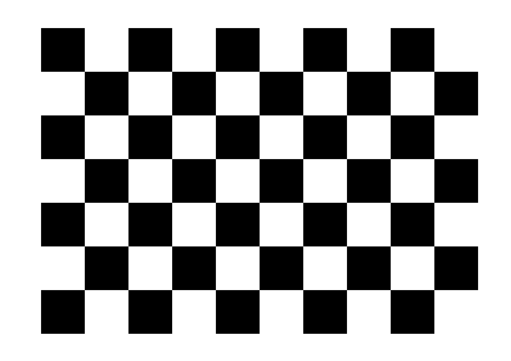

# UAV Drone autopilot, computer vision and image processing.
Spring 2018<br />
Lecturer: [K.W. Chen](https://www.cs.nctu.edu.tw/cswebsite/members/detail/kuanwen) in CS@NCTU <br />
Time: 4IJK @EC330_NCTU<br />

## Lab1. Introduction to Open CV and installation Mar 01, 2018
[Lab1 pdf](Lab1.pdf)
### Install Open CV
* In the Ubuntu 16.04 64bit
Required dependencies are the followings <br />
1.Git <br />
2.Python 2.6 or later and Numpy 1.5 or later with developer packages (python-dev, python-numpy) <br />
3.CMake 2.6 or higher <br />
4.GCC 4.4.x or later <br />

```
sudo apt-get install libopencv-dev python-opencv
```
Once installed
```
pkg-config --modversion opencv
```
If the version is shown, then we're good to rock with opencv. <br />

* Build your opencv_file.cpp with CMake or g++ standards

1.With CMake (Don't forget to add CMakeLists.txt)

```make
cmake_minimum_required(VERSION 2.8)
project( <project_name> )
find_package( OpenCV REQUIRED )
add_executable( <project_name> <project_name>.cpp )
target_link_libraries( <project_name> ${OpenCV_LIBS} )
```

2.With g++ and flags for opencv libraries
```
g++ lab1-2.cpp `pkg-config --cflags --libs opencv`
```
### Today's course contents
Basic understanding of image processing and image data format.
[Course week1 pdf](DIP_1.pdf)

[Bilinear Interpolation](https://en.wikipedia.org/wiki/Bilinear_interpolation)
Basically ,this is an algorithm aimed for image transformation in this lab. <br />
The interpolated value of a point is a reversely-weighted average of the neighboring points, <br />
such method is quite useful in the image transformation.


## Lab2. Image processing in spacial domain, linear and non-linear transformation Mar 08, 2018
* Spacial-domain image processing.
* Histogram equalization and mask processing    
* Edge detection algorithm: Sobel filter, Laplician smoothing (W.J.Tsai OS Fall2017 HW3) ,sharpening and dege detection.
* Computer vision <br />
1.Low level measurement such as brightness,Enhancements,Region segments,Features

### Today's course contents
[Course pdf](DIP_2.pdf)

### Today's lab, Spacial Domain histogram equalization.
* Problem1 Histogram equalization
1.We may use the vector to implement the map for statistical data.<br />
2.Accumulate using another vector <br />
3.Count and mapping to the relative proportion * max_value, then that's all <br />

NOTE!!!! THE DEFAULT IMG MAT IS 3-CHANNEL TYPE, NOT ONE CHANNEL GREY-SCALE, SO IF WE DONT DO THE GREY SCALE CONVERSION, ONLY 1/3 OF THE IMAGE WILL BE PROCESSED, THUS THE FOLLOWING CODE IS NEEDED
```cpp
Mat input_img = imread(argv[1]);
//since the bgr channel is used for default action, then the BGR 3 channel image must be converted to GREY channel
cvtColor(input_img, input_img, CV_BGR2GRAY);
Mat output_img = input_img.clone();
histogram_equal(input_img, output_img);
```    

```cpp

void histogram_equal(Mat& input, Mat& output)
{
    vector<int> hash_distribution;
    vector<double> intensity_cdf;
    hash_distribution.resize(256);
    intensity_cdf.resize(256);
    for(int i=0;i<input.rows;i++)
    {
        for(int j=0;j<input.cols;j++)
        {
            hash_distribution[(int) input.at<uchar>(i,j)]++;
        }
    }

    //search the maxium value
    int max_value = 0, cnt=0;
    double cumulative_cnt = 0.0f;
    for(int i=0;i<hash_distribution.size();i++)
    {
        if(hash_distribution[i]!=0)
        {
            max_value = max(max_value, i);
            cumulative_cnt += (double) hash_distribution[i] / (double)(input.rows * input.cols);
            cnt += hash_distribution[i];
            intensity_cdf[i] = cumulative_cnt;
            cout<<"cnt "<<cnt<<" at "<< i<<" Cumulate to "<<cumulative_cnt<<" where intensity is now "<<intensity_cdf[i]<<endl;
        }
    }
    for(int i=0;i<input.rows;i++)
    {
        for(int j=0;j<input.cols;j++)
        {
            output.at<uchar>(i,j) = (intensity_cdf[input.at<uchar>(i,j)] * max_value );
        }
    }
}

```
## Lab3. Brief introduction to Computer Vision  Mar 15, 2018
###Binary Machine Vision

###Today's lab, connected component labeling
[Check here](https://ccw1986.blogspot.tw/2016/03/connected-component-labeling-using.html)

## Lab4. Camera Calibration Mar 29, 2018
[Course pdf](Camera_Calibration.pdf)
### Camera Calibration
* (From official openCV document)Basically, you need to take snapshots of these patterns with your camera and let OpenCV find them. Each found pattern results in a new equation. To solve the equation you need at least a predetermined number of pattern snapshots to form a well-posed equation system. This number is higher for the chessboard pattern and less for the circle ones. For example, in theory the chessboard pattern requires at least two snapshots. However, in practice we have a good amount of noise present in our input images, so for good results you will probably need at least 10 good snapshots of the input pattern in different positions.
* First, download , measure the size of those square
* Take many photos (approx 50 images ) of this grid and save it as jpg file
* Iterate all the point on the

###Today's lab, camera calibration and wraping
[Lab4.pdf](Lab4.pdf)
